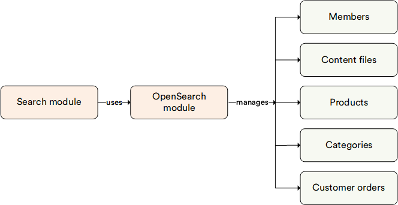

# Overview

The **OpenSearch** module serves as a search engine for the Search module. It leverages the OpenSearch engines to store indexed documents.

The module supports the following OpenSearch deployment options:

* [OpenSearch](https://opensearch.org/)
* [Amazon OpenSearch Service](https://aws.amazon.com/opensearch-service/)

## Key features

The diagram below illustrates the functionality of the OpenSearch module:

{: style="display: block; margin: 0 auto;" }

 
{: width="25"} [Blue-green indexing](../search/managing-search.md#blue-green-indexing)

 
 
********

    <a href="../../azure-search/overview">← Azure Search module overview</a>
    <a href="../settings">Settings →</a>

