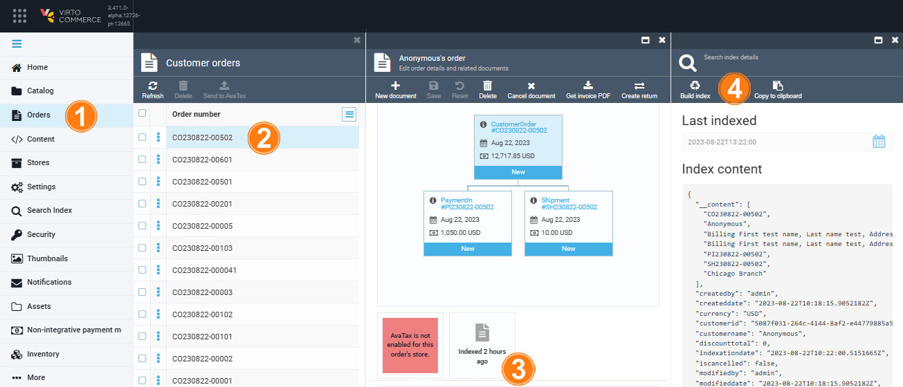

# Indexation

To start indexation:

1. In the main menu, click **Orders**.
1. In the next **Customer orders** blade, select the required order.
1. In the **Edit order details and related documents** blade, click on the **Indexation** widget.
1. In the next blade, click **Build index**.

    

1. The result of indexing is displayed in the next blade.

    

 
 
********

    <a href="../sending-order-information-to-avatax">← Sending order information to AvaTax</a>
    <a href="../notifications">Managing notifications →</a>

