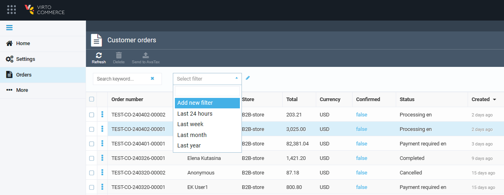
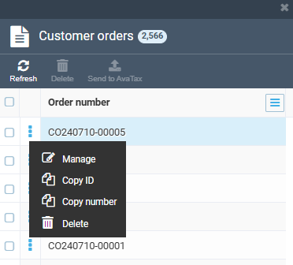
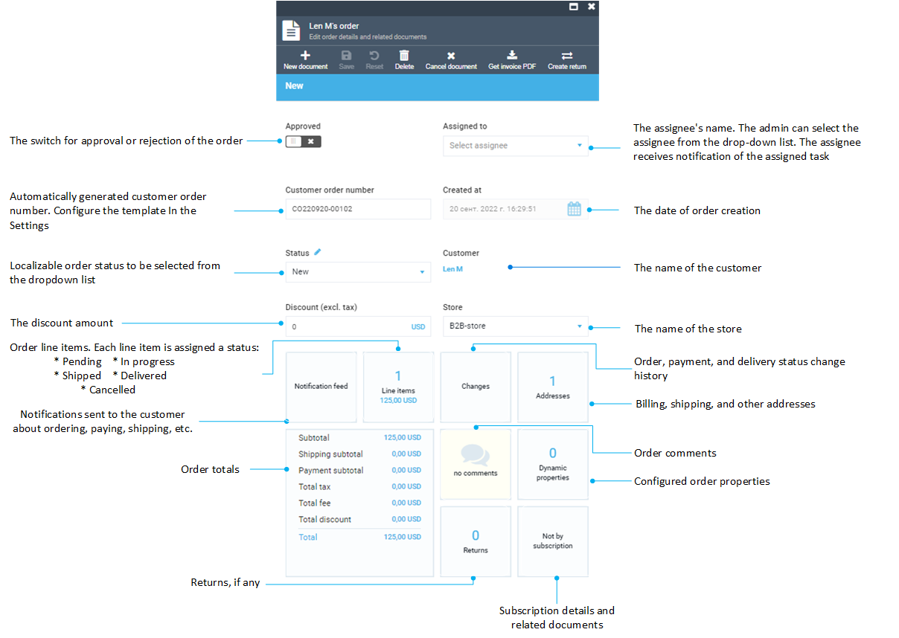
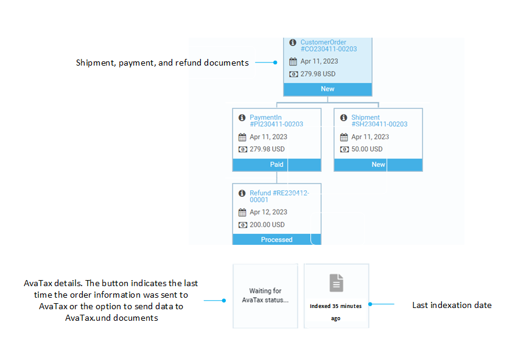

# Order Information

Once the order is created by the customer, the details are immediately displayed in the Virto Commerce platform.

To view the list of orders:

1. Click **Orders** in the main menu.
1. The next blade displays the list of customer orders, which can be filtered by the date ranges.

    

    Click on the three dots to the left of any order to open a dropdown menu and:

    - Start managing the order.
    - Copy order id.
    - Copy order number.
    - Delete the order.

    

1. Select an order from the list to view its details. 

## General Order Information

## Shipment, Payment, AvaTax Information

