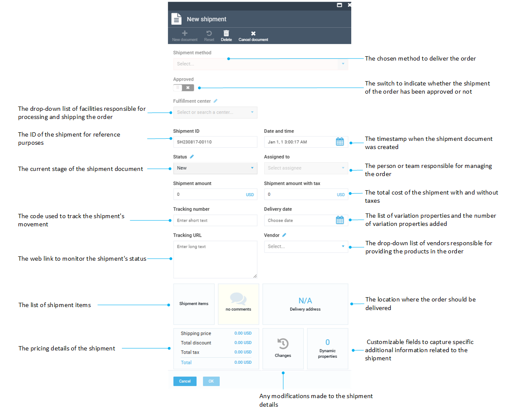
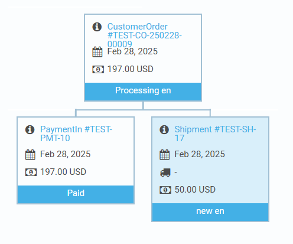
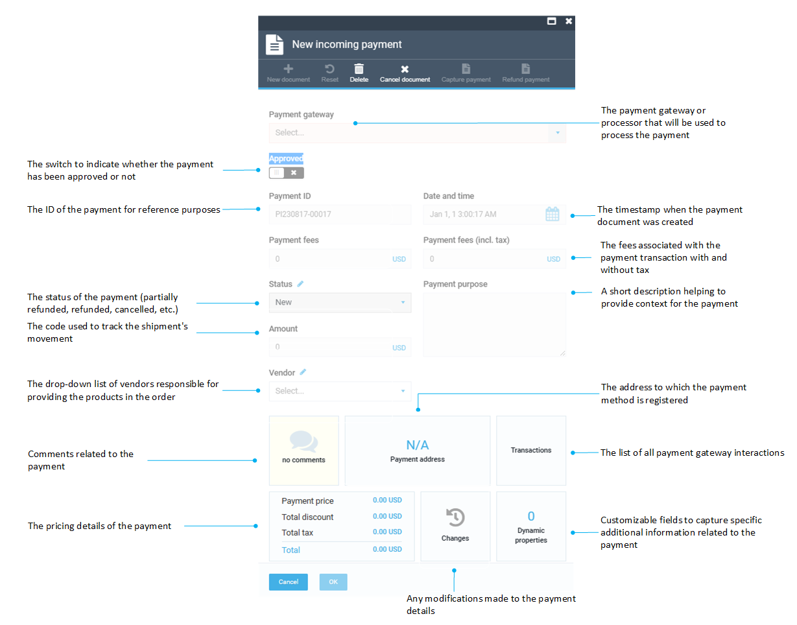
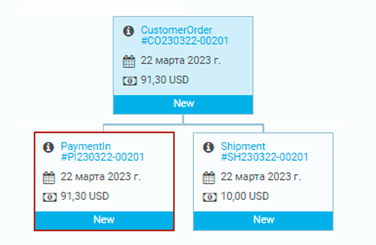
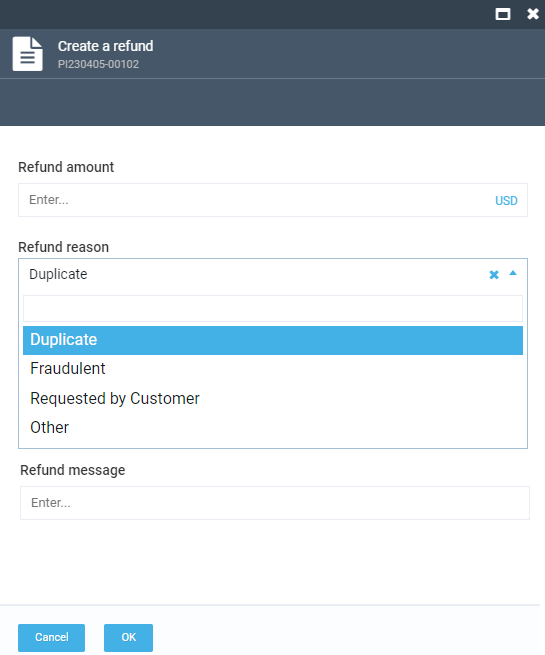
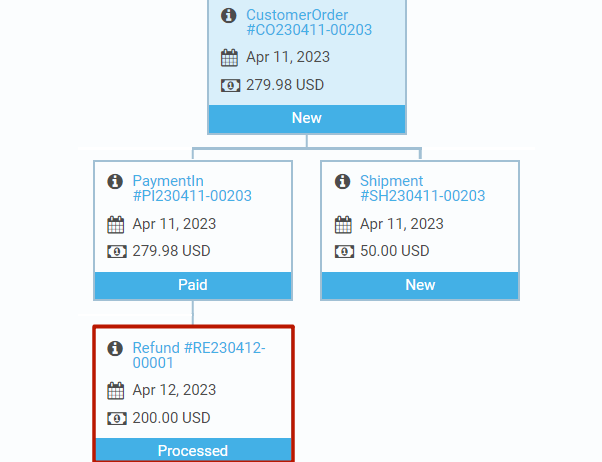
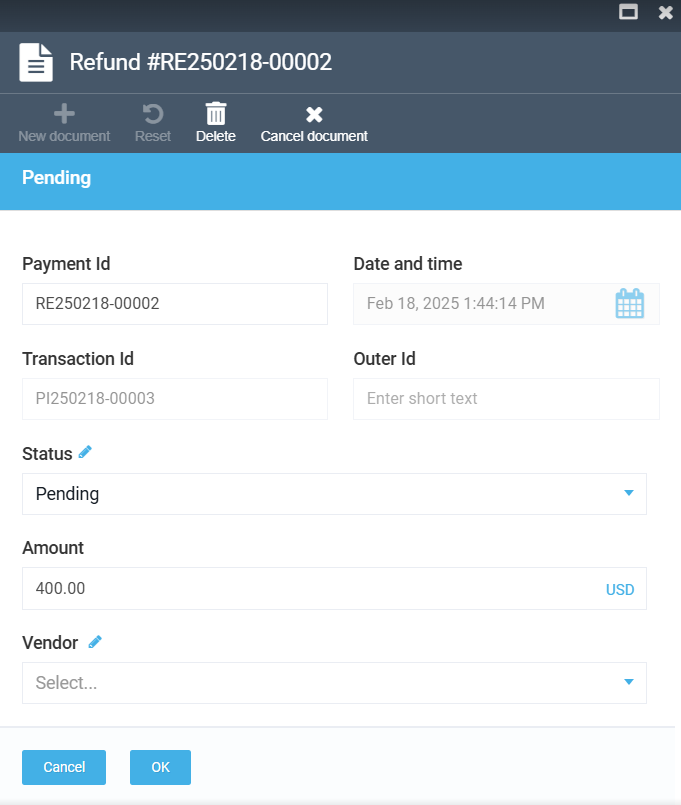

# Manage Documents

Managing documents in the Orders module includes:

* [Creating shipment documents.](#create-shipment-documents)
* [Creating payment documents.](#create-payment-documents)
    * [Capturing payment.](#capture-payment)
    * [Creating refund documents.](#create-refund-documents)
* [Getting invoice PDF.](#get-invoice-pdf)

To start managing documents:

1. In the main menu, click **Orders**.
1. In the next **Customer orders** blade, select the required order.

    !!! tip
        In this step, you can copy the current URL and paste it into a new window to open the desired order immediately.  

1. In the **Edit order details and related documents** blade, click **New document**.

{: width="700"}

## Create shipment documents

To create a new shipment document:

1. Follow steps 1-3 from the instruction above.
1. Click **Shipment** in the **Select operation type** blade.
1. In the next blade, fill in the fields of the new shipment document. Don't forget to switch the **Approved** option to on.

    

1. Click **OK** to save the changes.

All the shipment documents for the selected order can be found by clicking on the **Shipment** widget:

{: width="400" height="400"}

## Create payment documents

To create a new payment document:

1. Follow steps 1-3 from the instruction above.
1. Click **PaymentIn** in the **Select operation type** blade.
1. In the next blade, fill in the fields of the new payment document. Don't forget to switch the **Approved** option to on.

    

1. Click **OK** to save the changes.

All the payment documents for the selected order can be found by clicking on the **PaymentIn** widget:

{: width="400"}

### Capture payment

To capture payment:

1. Click on the **PaymentIn** widget where all the payment documents for the selected order are stored.
1. In the next blade, click **Capture payment** in the toolbar.
1. In the next blade, fill in the following fields:

    

1. Click **OK**. 

1. The new capture widget appears in the shipment and payment documents section:

    {: width="400"}

1. Click on it to view the details:

    {: width="400"}

### Create refund documents

To create a new refund document:

1. Click on the **PaymentIn** widget where all the payment documents for the selected order are stored.
1. In the next blade, check the payment status. Refunding is possible for the orders with the **Paid** status. 
1. Click **Refund payment** in the toolbar.
1. In the next blade, enter the refund amount, the refund message, and select the refund reason from the drop-down list. Click **OK** to save the changes.

    {: width="400"}

1. The new refund widget appears in the shipment and payment documents section.

    {: width="400"}

1. Click on it to see the details.

    {: width="400"}

## Get invoice PDF

To get an invoice in PDF format:

1. Follow steps 1-2 from the instruction above.
1. In the **Edit order details and related documents** blade, click **Get invoices PDF** in the toolbar. 

The invoice PDF opens in a new window.

