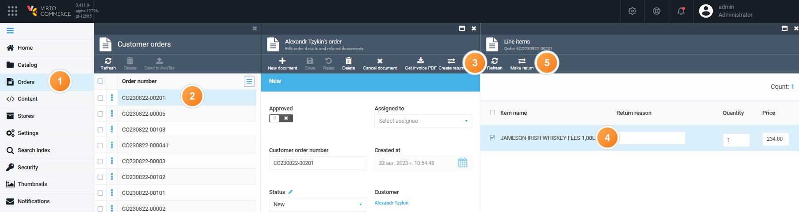
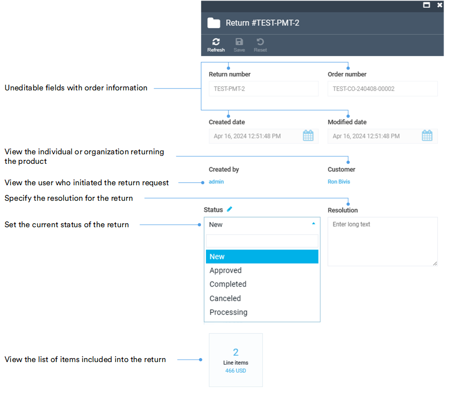
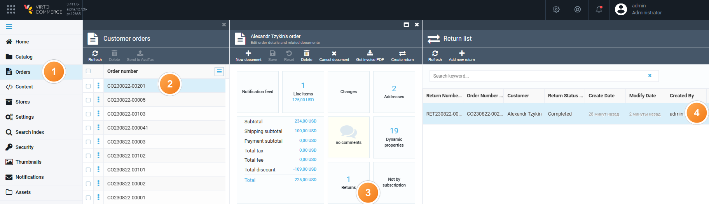
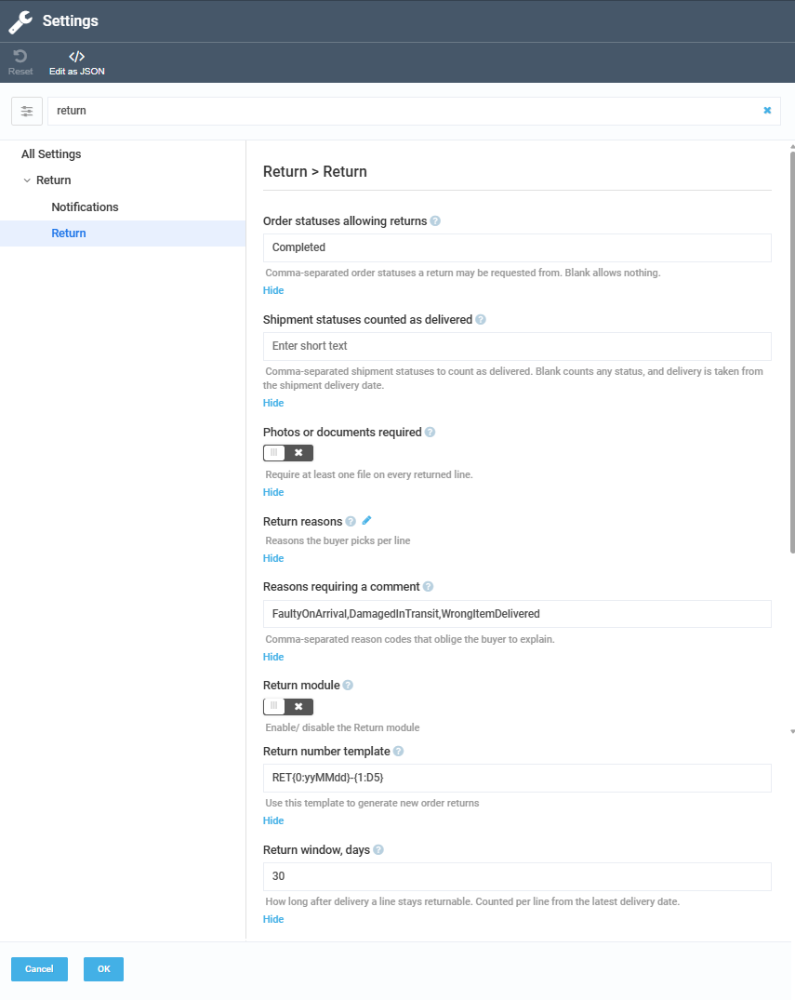
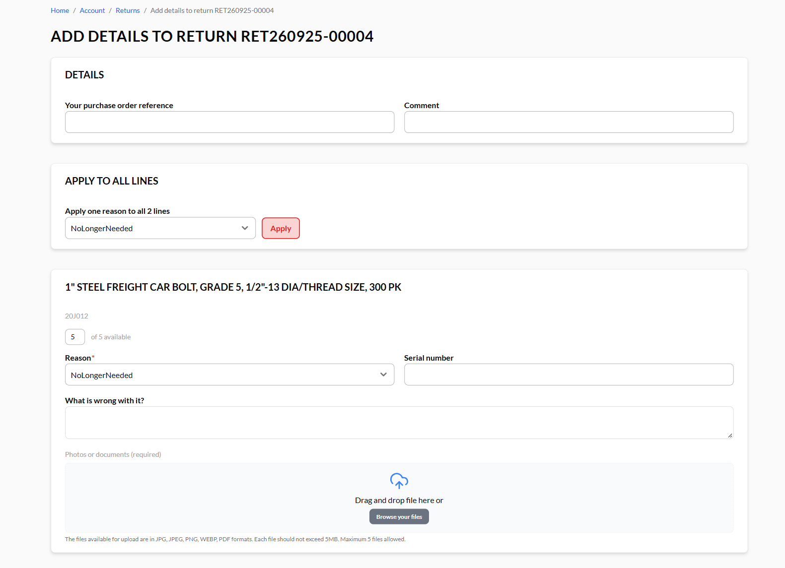
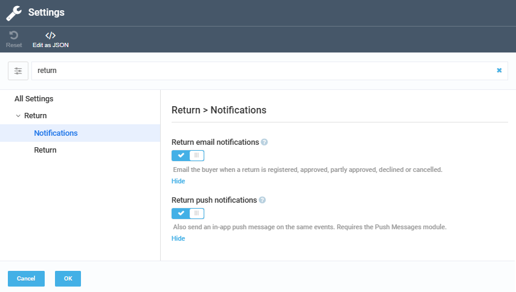

# Manage Returns

A return is created by an operator against an existing order in the Admin UI or upon the customer's request.

Managing returns includes:

* [Creating returns.](managing-returns.md#create-return)
* [Processing returns.](managing-returns.md#viewing-and-processing-returns)

## Create return

To create a return for a particular order:

1. In the main menu, click **Orders**.
1. In the next **Customer orders** blade select the required order.
1. In the **Edit order details and related documents** blade, click **Create return**.
1. In the new blade, check the items that require a return. You may check one or all items from the order. Enter the return reason, if necessary.
1. Click **Make return**.

    {: style="display: block; margin: 0 auto;" }

1. In the **Return** blade, edit the fields with the description typed in green:

    {: style="display: block; margin: 0 auto;" }

1. Click **Save** in the toolbar to save the changes.

The return has been created.

## View and process returns

To process the returns:

1. In the main menu, click **Orders**.
1. In the next **Customer orders** blade select the required order.
1. In the **Edit order details and related documents** blade, click the **Returns** widget.
1. In the next blade, select the required return from the list.

    {: style="display: block; margin: 0 auto;" }

1. In the **Return** blade, change the return status (**Completed**, **Approved**, or **Deleted**) and enter your resolution.
1. Click **Save** in the toolbar to save the changes.

The modifications have been saved.

## Settings

To configure settings related to the returns feature:

1. Click **Stores** in the main menu.
1. In the next blade, select your store.
1. In the next blade, type **Return** to find settings related to the feature.

    1. Select **Return** to configure the following settings, then click **OK** and **Save**.:

        {: style="display: block; margin: 0 auto;" }

        On the Frontend, your modifications are applied as follows:

        {: style="display: block; margin: 0 auto;" }

    1. Select **Notifications** to configure the following settings, then click **OK** and **Save**:

        {: style="display: block; margin: 0 auto;" }

Your modifications have been applied.

 
 
********

    <a href="../tracking-order-changes">← Tracking order changes</a>
    <a href="../sending-order-information-to-avatax">Sending order information to AvaTax →</a>

