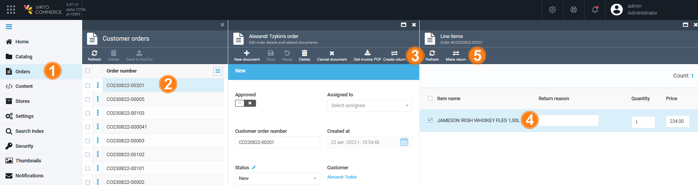

# Manage Returns

Managing returns includes:

* [Creating returns.](managing-returns.md#create-return)
* [Processing returns.](managing-returns.md#viewing-and-processing-returns)

# Create return

To create a return for a particular order:

1. In the main menu, click **Orders**.
1. In the next **Customer orders** blade select the required order.
1. In the **Edit order details and related documents** blade, click **Create return**.
1. In the new blade, check the items that require a return. Enter the return reason, if necessary.
1. Click **Make return**.

    

1. In the **Return** blade, edit the fields with the description typed in green:

    

1. Сlick **Save** in the toolbar to save the changes.

The return has been created.

# View and Process Returns

To process the returns:

1. In the main menu, click **Orders**.
1. In the next **Customer orders** blade select the required order.
1. In the **Edit order details and related documents** blade, click on the **Returns** widget.
1. In the next blade, select the required return from the list.

    

1. In the **Return** blade, change the return status and enter your resolution.
1. Click **Save** in the toolbar to save the changes.

The modifications have been saved.