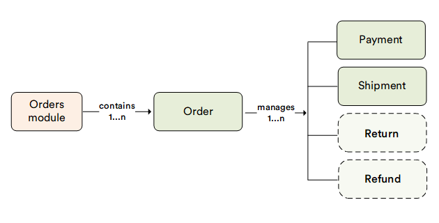

# Overview

In Virto Commerce Platform, Orders are managed via the **Order (Orders)** module and the **Order management** module representing a document-based flexible orders management system with possibility to add unlimited number of documents related to customer order. Install both modules to ensure full functionality and optimal performance in order management.

The **Order** module is designed to:

* Store order details.
* Manage orders created by users on client side. 
* Search for orders by keywords.

!!! info
    This module is not designed to be a full order processing system like ERP. It serves as storage for customer orders details and can be synchronized with different external processing systems.

The order itself contains minimum details.  You will find payment, shipment, and other order details on the documents.

The **Order management** modules is designed to:

* Add or remove line items from the order.
* Ensure accurate price calculations based on the Frontend Application logic, applying relevant discounts, store settings, and customer-specific pricing. 

!!! note
    The order management process in Virto Commerce OMS is not coded and not pre-determined. This system is designed as an Order Details Editor with no validation logics available. The system is implied to be an additional storage for customer orders details.

## Key features

The diagram below illustrates the interconnections among various key entities within the Orders module:

{: style="display: block; margin: 0 auto;" }
 

With the Orders module, you can:

* [Manage shipment, payment, and refund documents](managing-documents.md)
* [Manage returns](managing-returns.md)
* [Send order information to Avalara](sending-order-information-to-avatax.md)
* [Track order changes](tracking-order-changes.md)

 
 
********

    <a href="../../inventory/overview">← Inventory module overview</a>
    <a href="../main-objects">Order information →</a>

