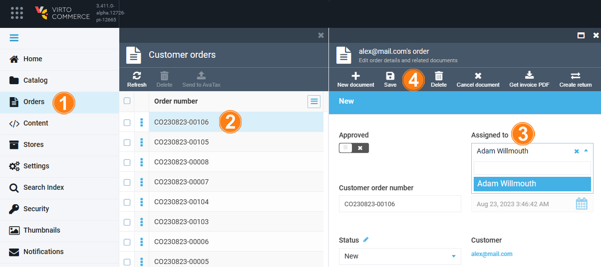

# Permissions

To maintain data security and privacy, specify what actions, such as reading, writing, deleting, or modifying data, a user can perform.

The pre-defined order-related permissions are:

| Permission               	| Description               	|
|------------------------	|----------------------------	|
| order:read             	| View order related data.   	|
| order:create           	| Create order related data. 	|
| order:update           	| Update order related data. 	|
| order:access           	| Access order related data. 	|
| order:delete           	| Delete order related data  	|
| order:read_prices      	| View order prices.         	|
| order:update_shipments 	| Update shipments.          	|
| order:capture_payment  	| Capture payment.           	|
| order:refund           	| Refund order.              	|

## Assign users to proceed orders

To assign order procession to specific users: 

1. In the main menu, click **Orders**.
1. In the next **Customer orders** blade, select the required order.
1. In the **Assigned to** field, select the assignee from a dropdown.
1. Click **Save** to save the changes.

    {: style="display: block; margin: 0 auto;" width="800"}

Now only the assigned user can process the order.

{: width="25"} [Creating new role](https://docs.virtocommerce.org/new/user-guide/security/roles-and-permissions/#creating-new-role) 

{: width="25"} [Editing roles](https://docs.virtocommerce.org/new/user-guide/security/roles-and-permissions/#editing-roles)

 
 
********

    <a href="../notifications">← Managing notifications</a>
    <a href="../settings">Order module settings →</a>

