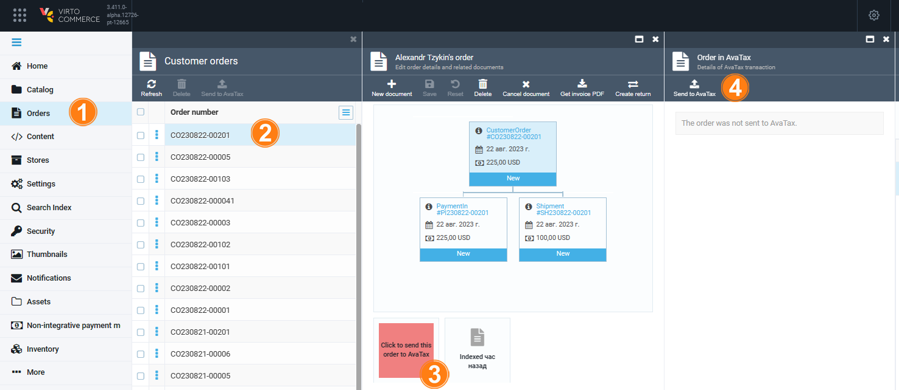
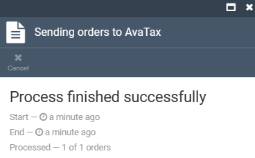
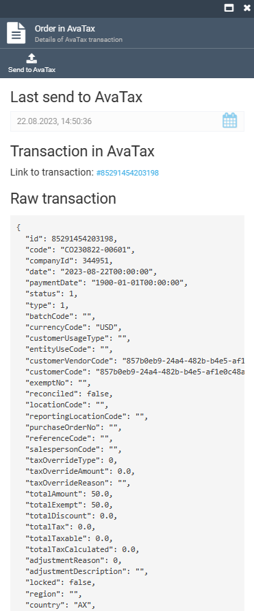

# Send Order Information to AvaTax

The order information can be sent to AvaTax:

* [Manually.](sending-order-information-to-avatax.md)
* [Automatically.](../integrations/avalara/taxes-calculation.md)

To send the order information to AvaTax manually:

1. In the main menu, click **Orders**.
1. In the next **Customer orders** blade, select the required order.
1. In the **Edit order details and related documents** blade, click on the AvaTax widget.
1. In the next **Order in AvaTax** blade, click **Send to AvaTax**. 

    

1. The result of the operation is displayed in the next blade.

    

1. Click on the Avatax widget to see the updated information:

    
