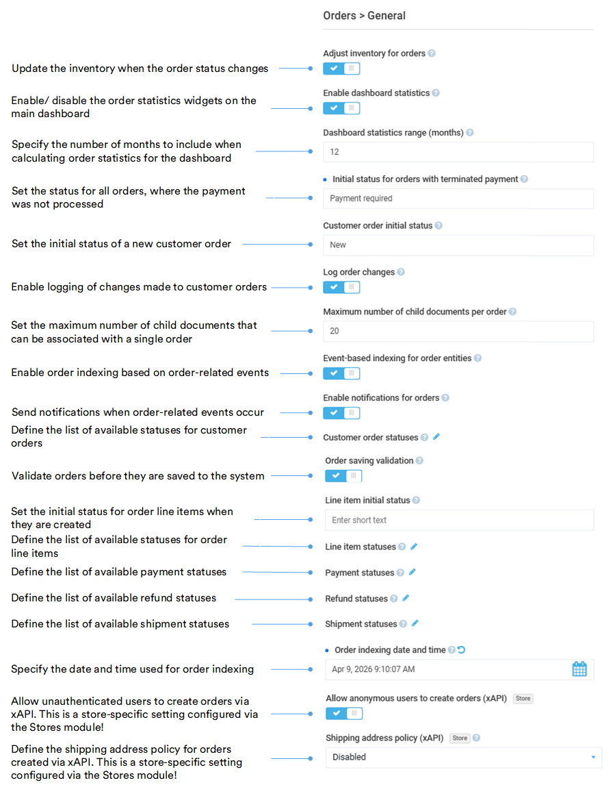
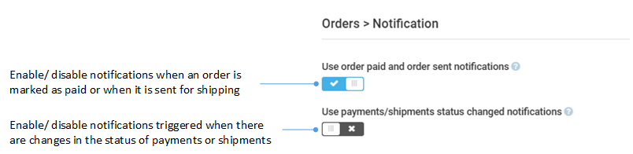
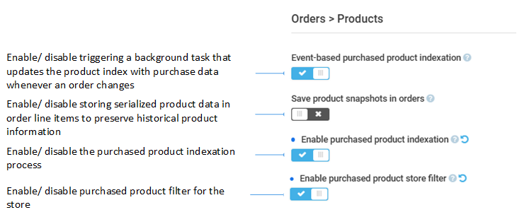
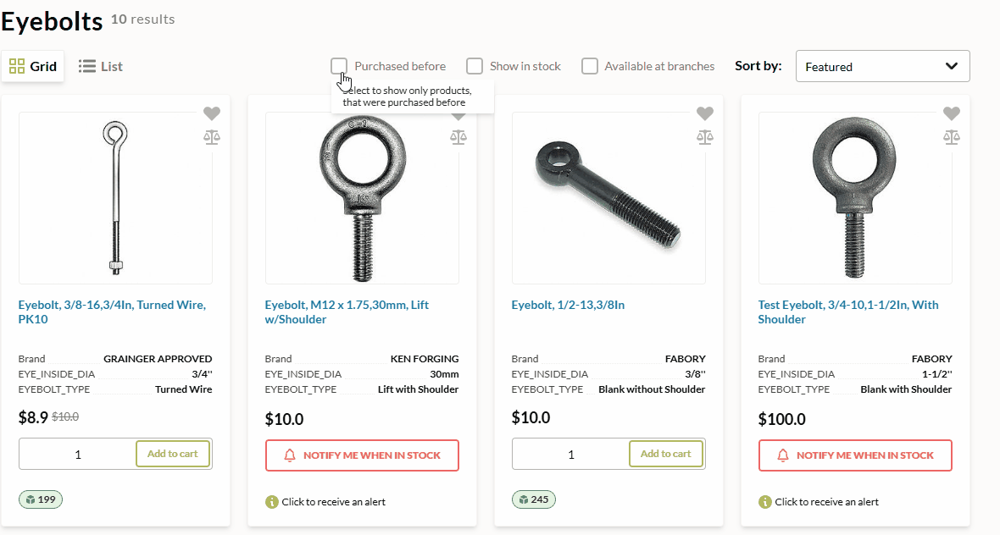
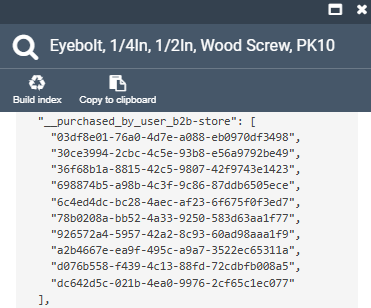
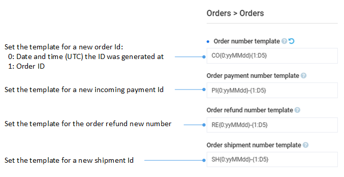

# Settings

To manage the settings:

1. Click **Settings** in the main menu.
1. In the search field of the next blade, type **Orders** to find the settings related to the module.
1. Select:
    * [General settings.](#general-settings)
    * [Notification settings.](#notification-settings)
    * [Products settings.](#products-settings)
    * [Template settings.](#template-settings)

## General settings

In the general settings blade, you can find both global and store-specific settings and configure order, shipment, and payment statuses, enable order changes logging or event-based indexing and more:

{: style="display: block; margin: 0 auto;" }

## Notification settings

In the **Notification** blade, you can configure notifications sent to the users:

{: style="display: block; margin: 0 auto;" }

## Products settings

In the **Products** blade, you can configure the following settings:

{: style="display: block; margin: 0 auto;" }

### Purchased before filter

The **Purchased before store filter** setting enables or disables corresponding filter on the frontend:

{: style="display: block; margin: 0 auto;" }

This setting activates the logic to enrich the product index with customer purchase history. It also extends the product index schema with a new field: `__purchase_by_user_<StoreId>`, containing user IDs of customers who have previously purchased the product:

{: style="display: block; margin: 0 auto;" }

[Rebuild the product index](../catalog/product-indexing.md) to populate the `__purchase_by_user_<StoreId>` fields with historical data.

To update the index with the corresponding user IDs upon new order creation, [trigger an update via the event](#products-settings) after the order has been successfully created.

## Template settings

To open store-specific template settings:

1. Open **Stores** from the main menu.
1. In the next blade, select  your store.
1. In the next blade, click on the **Settings** widget.
1. Find **Order** settings in the left panel and configure the following:

    {: style="display: block; margin: 0 auto;" }

1. Click **Save** in the toolbar to save the changes.

Your modifications have been applied.

 
 
********

    <a href="../permissions">← Managing permissions</a>
    <a href="../../contacts/overview">Contacts module overview →</a>

