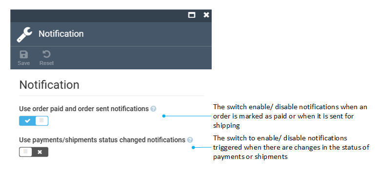

# Settings

To manage the settings:

1. Click **Settings** in the main menu.
1. In the next blade, type **Orders** to find the settings related to the module.
1. Select **Orders**.
1. Select:
    * [General settings](#general-settings)
    * [Search settings](#notification-settings)
    * [Orders templates settings](#orders-templates-settings)
    * [Products settings](#products-settings)

{: style="display: block; margin: 0 auto;" width="700"}

## General settings

In the general settings blade, you can configure order, shipment, and payment statuses, enable order changes logging or event-based indexing and more. 

{: style="display: block; margin: 0 auto;" }

## Notification settings

In the **Notification** blade, you can configure notifications sent to the users.

{: style="display: block; margin: 0 auto;" }

## Orders templates settings

In the **Orders** blade, you can configure templates for order, shipment, payment, and refund Ids. 

{: style="display: block; margin: 0 auto;" }

## Products settings

In the **Products** blade, you can:

* Trigger a background task to add purchase data to the product index.
* Enable purchased product indexation.
* Enable the [purchased product store filter](../store/settings.md#products-settings):

 
 
********

    <a href="../permissions">← Managing permissions</a>
    <a href="../../contacts/overview">Contacts module overview →</a>

