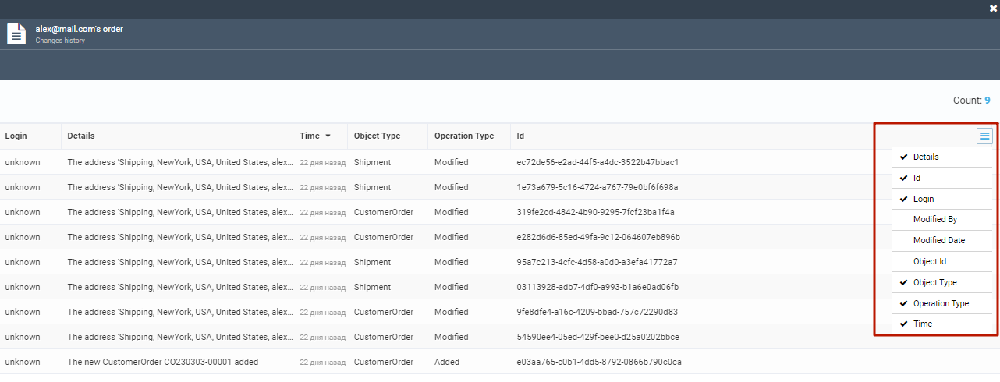

# Track Order Changes

To view the order changes history, including payment, shipment, and other modifications:

1. In the main menu, click **Orders**.
1. In the next **Customer orders** blade, select the required order.
1. In the **Edit order details and related documents** blade, click on the **Changes** widget.

    {: width="700" height="600"}

1. Information about order placement, payment, shipment, etc. appears in the new blade. Select additional information fields from the drop-down list in the upper right corner.

    
