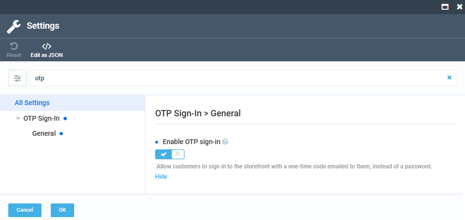

# Enable OTP Sign-In

Install the OTP module the same way as [other modules](/platform/user-guide/latest/modules-installation).

## Prerequisites

Before configuring the module, make sure you have:

* [Virto Commerce Platform, version 3.1075.0 or higher](https://github.com/VirtoCommerce/vc-platform/releases/tag/3.1075.0), running a release build. On a prerelease build, the module is skipped as incompatible.
* [Virto Commerce Customer module](https://github.com/VirtoCommerce/vc-module-customer).
* [Virto Commerce Notifications module](https://github.com/VirtoCommerce/vc-module-notification).
* [Virto Commerce Store module](https://github.com/VirtoCommerce/vc-module-store).

## Enable OTP sign-in

To enable OTP sign-in for a store:

1. Click **Stores** in the main menu.
1. In the next blade, select your store.
1. In the next blade, click the **Settings** widget.
1. In the search field of the next blade, type **OTP** to find the setting related to the module.
1. Turn the **Enable OTP sign-in** option to on.
1. Click **OK**.

    

1. Click **Save** in the toolbar to save the changes.

Customers can now sign in to the Frontend with a one-time code emailed to them, instead of a password. 

 
 
********

    <a href="../overview">← OTP module overview</a>
    <a href="../../back-in-stock/overview">Back-in-Stock module overview →</a>

