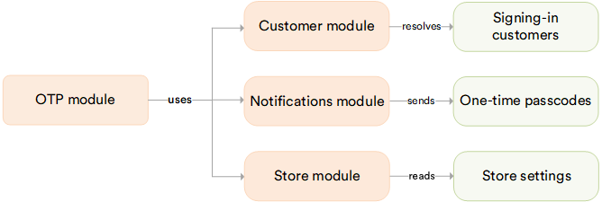

# OTP

The **OTP** module lets a customer sign in to the Frontend with a one-time passcode instead of a password.

## Key features

* Turned on and configured independently for each store.
* The one-time code is delivered through the Notifications module, over an already-configured notification channel.

The diagram below shows the OTP module dependencies:

{: style="display: block; margin: 0 auto;" }

 
 
********

    <a href="../../azure-ad/enabling-authentication-types">← Enabling authentication types</a>
    <a href="../enabling-otp">Enabling OTP sign-in →</a>

