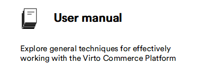
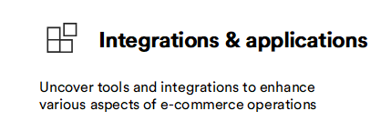
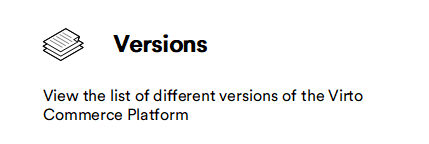

# Overview

This guide will show you how to effortlessly customise your platform, improve customer experience and streamline operations through the intuitive use of modules and integrations. In the Modules section, you will find a list of available modules, along with detailed instructions on how to install and optimise them. The Integrations section explores connecting Virto Platform to external tools such as Google Analytics, Hotjar, and Avalara Tax.

You can [request a demo](https://virtocommerce.com/request-demo) or [deploy Platform]() to assess all the Platform's advantages.

|Item|Description|
|---|---|
|  | <ul><li> [General guidelines](general-guidelines.md)</li><li> [User profile](user-profile.md) </li> <li>[Modules installation](modules-installation.md)</li> <li>[Start your first store](getting-started.md)</li></ul>|
|  | <ul><li> [List of available modules](platform-overview.md)</li> <li> [Create catalog](catalog/add-new-catalog.md) </li> <li>[Configure store](store/adding-new-store.md) and [prices](pricing/creating-new-price-list.md)</li> <li>[Configure payments,](payment/managing-payment-methods.md) [shipments,](shipping/managing-shipping-methods.md) and [taxes](tax/managing-taxes.md) </li> <li> [Launch promotions](marketing/managing-promotions.md) </li><li> [Configure inventory](inventory/managing-inventory.md) </li></ul>|
|  | <ul><li> [Avalara Tax](integrations/avalara/overview.md)</li> <li> [Google Analytics](integrations/google-analytics/overview.md) </li> <li>[Hotjar](integrations/hotjar/overview.md)</li> <li> [Push messages](push-messages/manage-push-messages.md)</li> </ul>|
|  | <ul><li> [View product versions](versions/virto3-products-versions.md)</li></ul>|

