# Configure Content Blocks in Designer

The **Designer** provides a visual interface for creating and managing page content. You can add content blocks from the available block library, configure their content and appearance, and arrange them on the page.

## Add content blocks to page

To add content to your page in the Designer mode:

1. Select your page from the list in either Page Builder or the Content section.
1. In the next blade, click **Open designer** to open your page in Page Builder.
1. In Page Builder, click **Add block** in the left menu to open the block library. The available blocks are as follows:

    

    -   __Call to action:__

    -   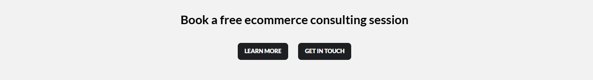

    -   __Call to action with image:__

    -   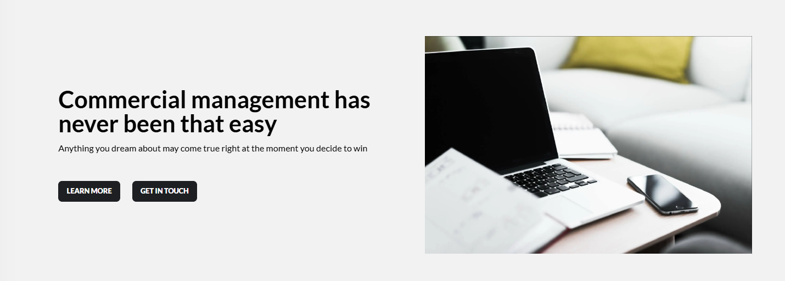

    -   __Category:__

    -   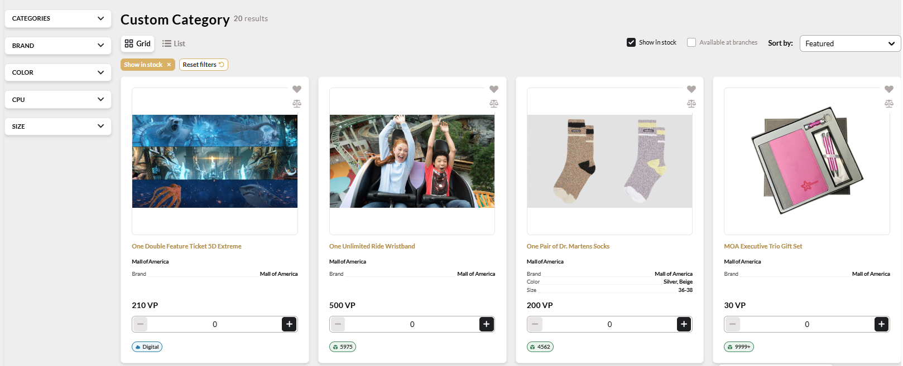

    -   __Favorite products:__

    -   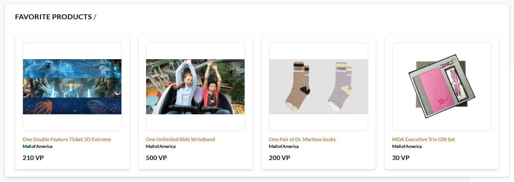

    -   __Features:__

    -   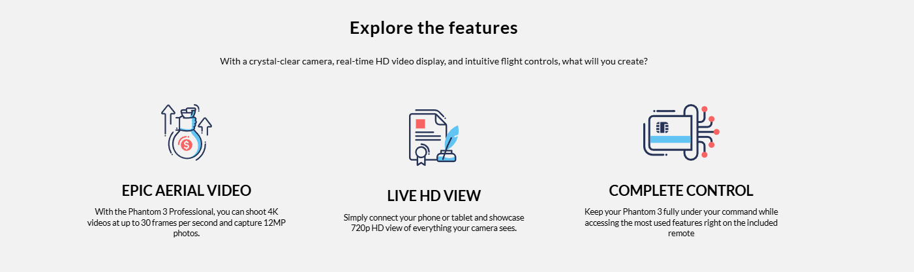

    -   __Image:__

    -   

    -   __Login:__

    -   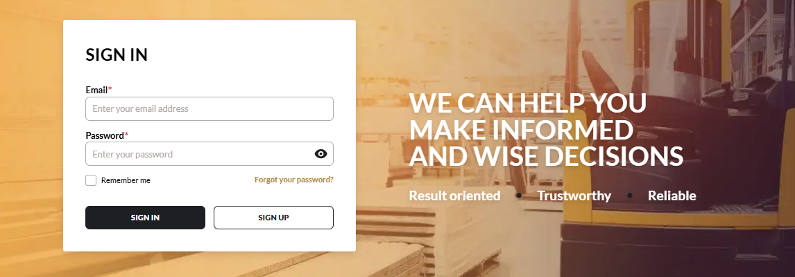

    -   __Predefined products:__

    -   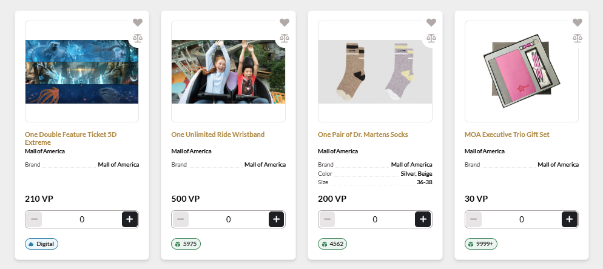

    -   __Products:__

    -   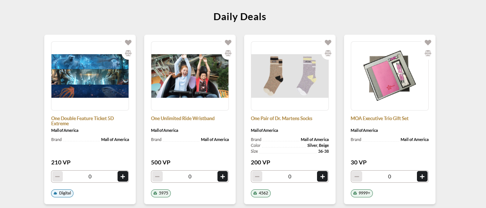

    -   __Products carousel:__

    -   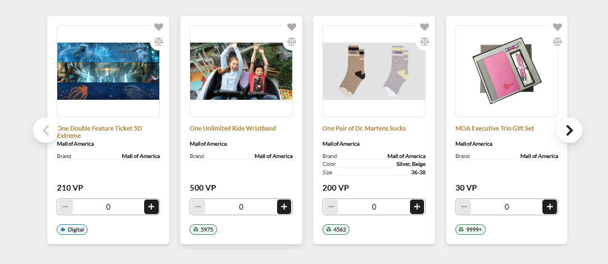

    -   __Slider:__

    -   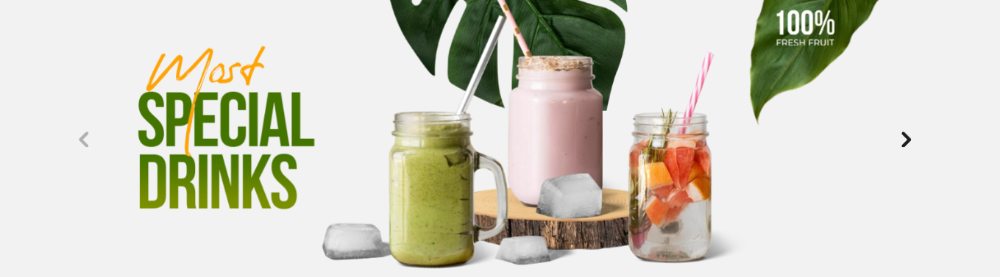

    -   __Subscribe form:__

    -   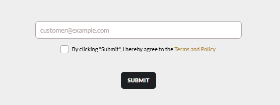

    -   __Text:__

    -   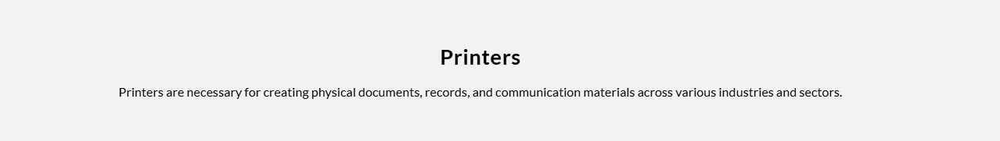

    -   __Title:__

    -   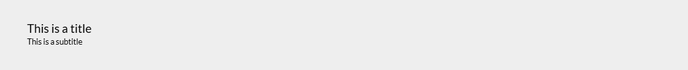

    

1. Click the desired block, then click **Add** to add it to the page. For example, let's add **Call to action with image** block:

    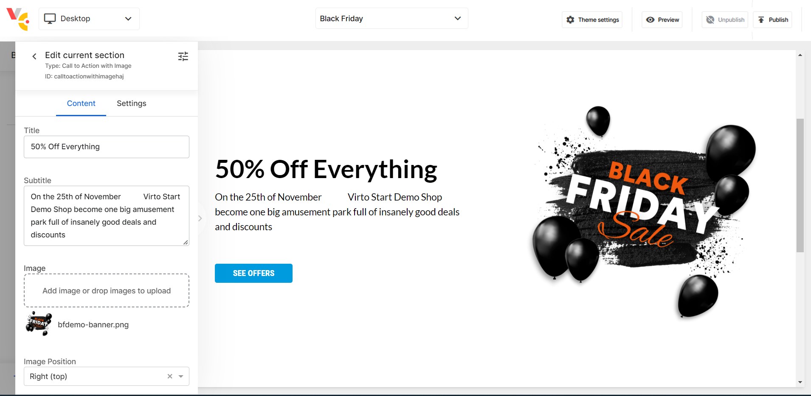{: style="display: block; margin: 0 auto;" }

1. Click **Save** to save the changes.

The added content is saved. Continue adding content until your page is ready for publishing.

## Configure blocks content

When you add a new content block in the **Designer** mode, configure its properties in the following tabs:

* **Default**: Contains the main content and display properties of the block.
* **Settings**: Contains additional properties that control how the block is identified and displayed. 

The available fields depend on the selected block type.

### Text block example

The **Default** tab of the **Text** block includes the following fields:

| Field       | Description                                                                                                                                |
| ----------- | ------------------------------------------------------------------------------------------------------------------------------------------ |
| **Title**   | Specifies the title of the content block.                                                                                                  |
| **Heading** | Specifies the heading level for the title, such as **H2**, **H3**, or another available level.                                             |
| **Content** | Contains the main content of the block. The editor supports text formatting, lists, links, images, and other available formatting options. |

The **Settings** tab of the **Text** block includes the following fields:

| Field          | Description                                                                                                              |
| -------------- | ------------------------------------------------------------------------------------------------------------------------ |
| **Anchor**     | Specifies a unique anchor for the block. The anchor can be used to link directly to this section of the page. Users can use the default anchor name or specify a custom name.            |
| **Background** | Specifies the background color of the block.  |

### Add links to text

Users can add links to selected text within a **Subscribe form** block.

1. Add a **Subscribe form** block to your page.
1. In the **Default** tab, select the text to which you want to add a link.
1. Click the link icon {: width="20"} to open the **Link** dialog:

    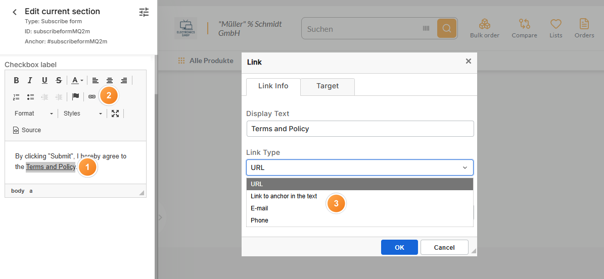{: style="display: block; margin: 0 auto;" }

1. Select one of the following link types:

    * **URL**: Adds a link to a web page or other URL.
    * **Link to anchor in the text**: Links to a specific section or anchor within the text.
    * **E-mail**: Creates a link that opens the user's default email application.
    * **Phone**: Creates a link that allows users to call the specified phone number.

1. Enter the required link details.
1. Click **OK** to save the link.
1. Click **Save** to apply the changes.
1. Publish the page.

The link has been added to the selected text and published on the page.

## Create and add shared components

Users can create, add, and delete shared components to be used across multiple pages, with the option to synchronize changes across all instances or edit each copy independently:

  
  

    <iframe loading="lazy" class="sl-demo" src="https://app.storylane.io/demo/dlumb01y2qr0?embed=inline" name="sl-embed" allow="fullscreen" allowfullscreen style="position:absolute;top:0;left:0;width:100%!important;height:100%!important;border:1px solid rgba(63,95,172,0.35);box-shadow: 0px 0px 18px rgba(26, 19, 72, 0.15);border-radius:10px;box-sizing:border-box;"></iframe>
  

 
 
********

    <a href="../manage-pages-via-office">← Managing pages via Page Builder office </a>
    <a href="../preview-as-user">Preview as user →</a>

