# Manage Pages via Page Builder Office

Managing pages includes:

* [Creating new pages.](#create-new-page)
* [Adding content to pages.](#add-content-to-page)
* [Publishing and unpublishing pages.](#publish-or-unpublish-pages)
* [Exporting pages.](#export-page)
* [Importing pages.](#import-page)
* [Cloning pages.](#clone-page)
* [Customizing pages for specific users.](#customize-pages-for-specific-users)

## Create new page

To create a new page:

1. Click **Stores** in the main menu.
1. In the next blade, select the required store.
1. In the next blade, click on the **Page Builder** widget to open the Page Builder Office:

    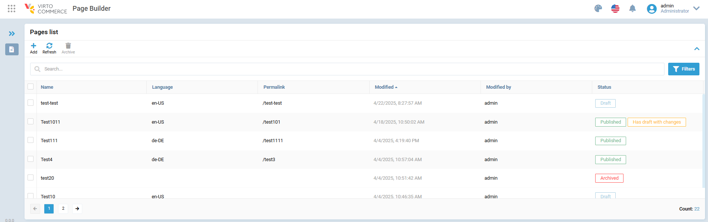{: style="display: block; margin: 0 auto;" }

1. Click **Add** in the toolbar.
1. In the next blade, fill in the following fields:

    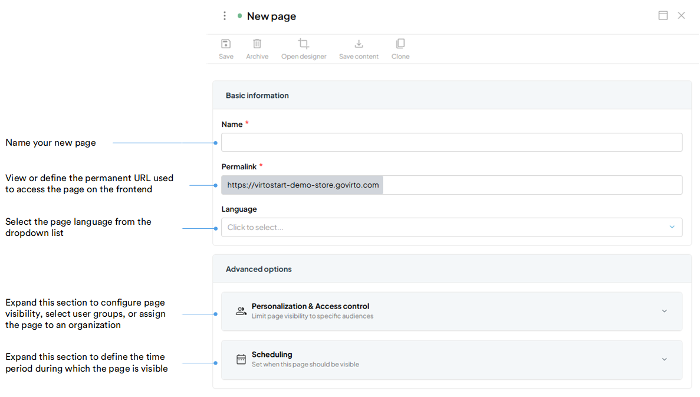{: style="display: block; margin: 0 auto;" }

1. Click **Save** in the toolbar. 

Your new page appears in the list of pages with the **Draft** status.

## Add content to page

To add content to your page:

1. Select your page from the list.
1. In the next blade, click **Open designer** to open your page in Page Builder.
1. In Page Builder, click **Add block** in the left menu to open the block library. The available blocks are as follows:

    

    -   __Call to action:__

        ---

        

    -   __Call to action with image:__

        ---

        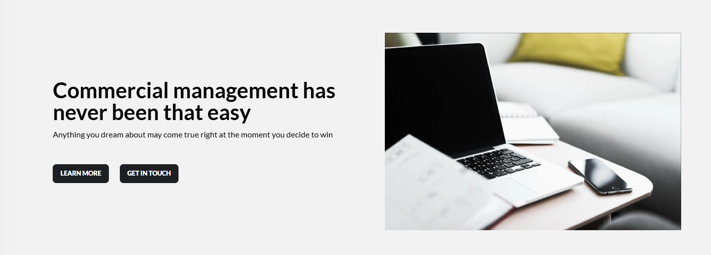

    -   __Category:__

        ---

        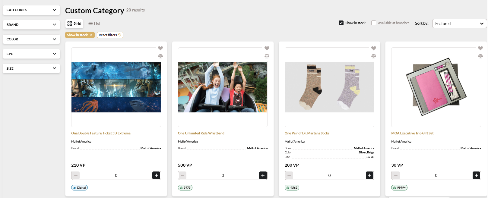

    -   __Favorite products:__

        ---

        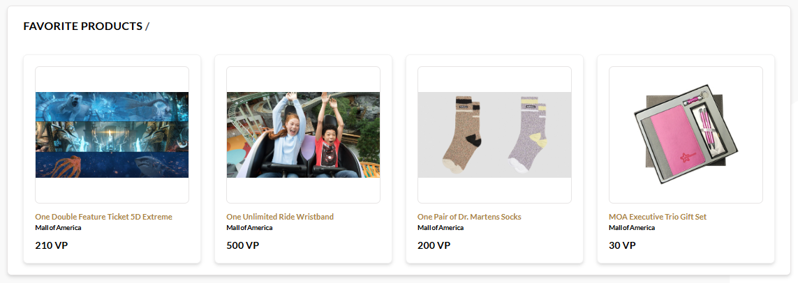

    -   __Features:__

        ---

        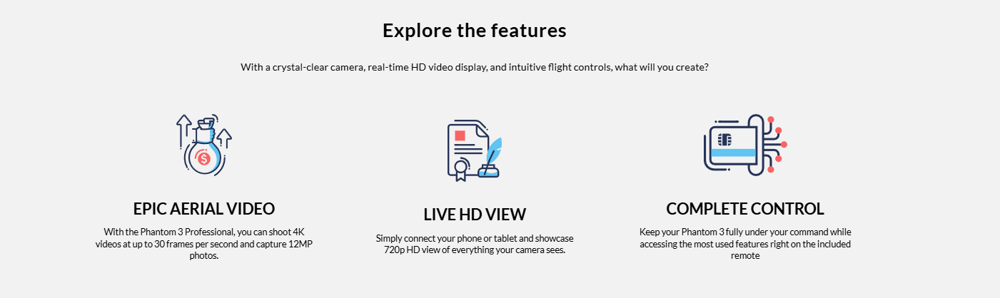

    -   __Image:__

        ---

        

    -   __Login:__

        ---

        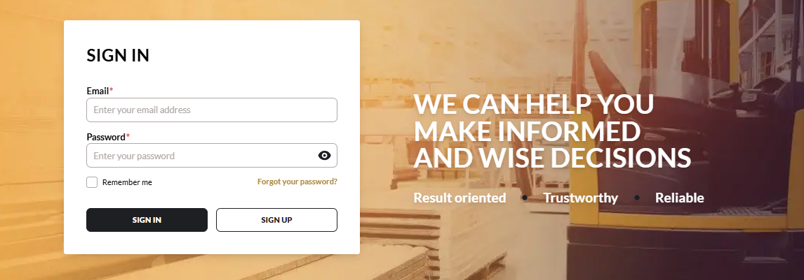

    -   __Predefined products:__

        ---

        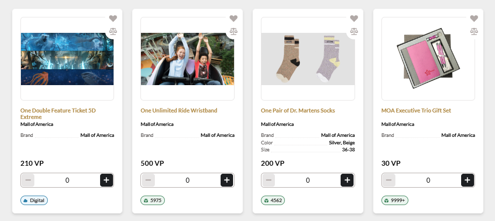

    -   __Products:__

        ---

        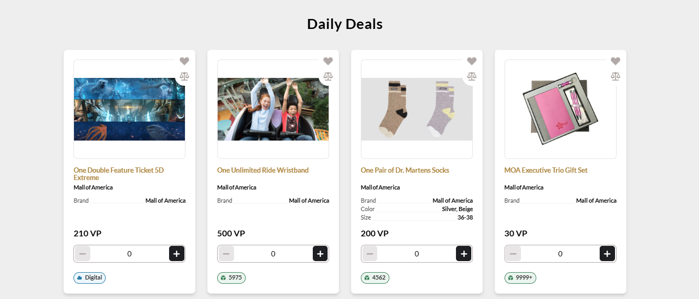

    -   __Products carousel:__

        ---

        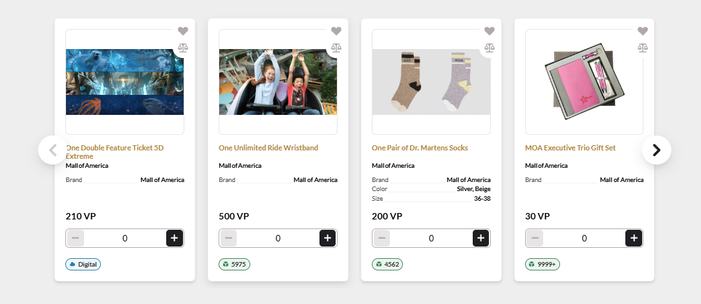

    -   __Slider:__

        ---

        

    -   __Subscribe form:__

        ---

        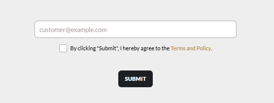

    -   __Text:__

        ---

        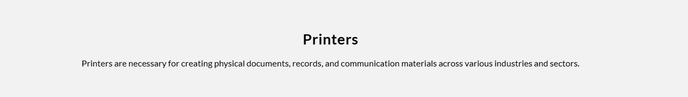

    -   __Title:__

        ---

        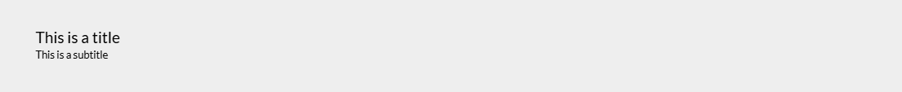

    

1. Click on the desired block, then click **Add** to add it to the page. For example, let's add **Call to action with image** block:

    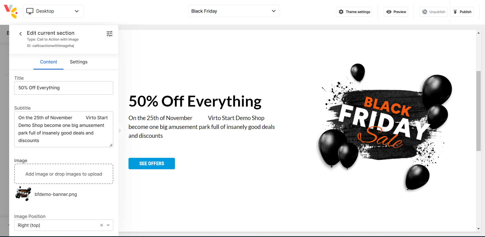{: style="display: block; margin: 0 auto;" }

1. Click **Save** to save the changes.

The added content is saved. Continue adding content until your page is ready for publishing. 

## Publish or unpublish pages

When your page is ready for publishing, click **Publish** in the upper right corner. The page will have the extension **.page**. It will be added to your store website. 

If your page is outdated, click **Unpublish** in the upper right corner. The page will be removed from your store website.

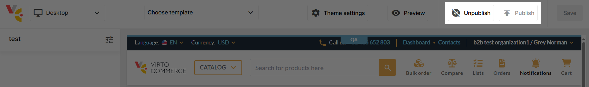{: style="display: block; margin: 0 auto;" }

Alternatively, you can publish your page from Page Builder Office later:

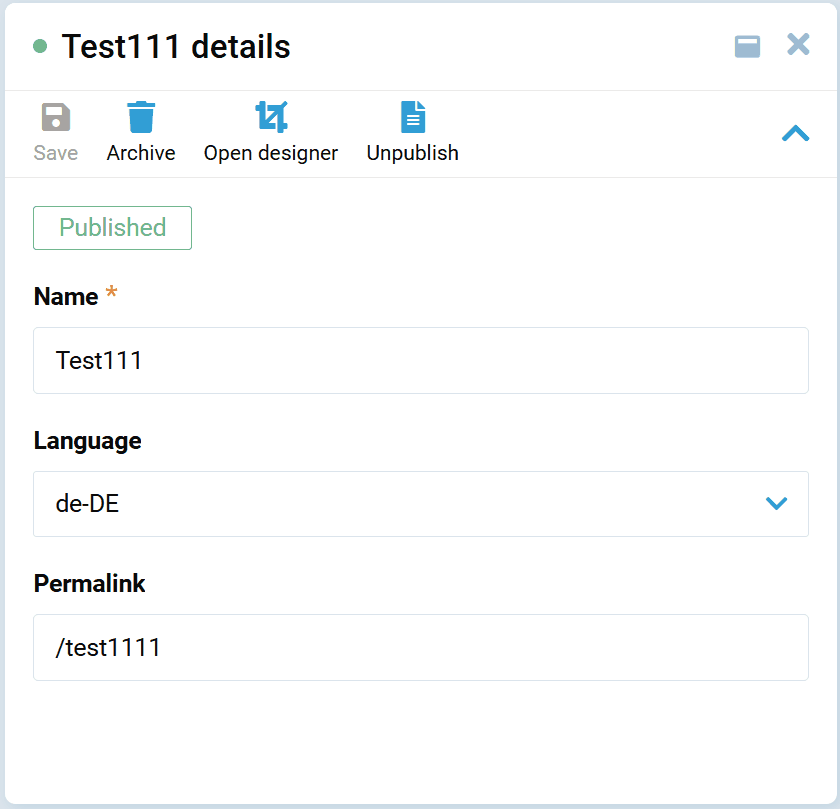{: style="display: block; margin: 0 auto;" width="500"}

## Export page

To download a page's content as a JSON file including all blocks and their settings, i.e. to export page:

1. Open the Page Builder Office.
1. Select a page from the **Draft**, **Active**, or **Archived** tab from the left menu.
1. In the next blade, click **Save content** in the toolbar:

    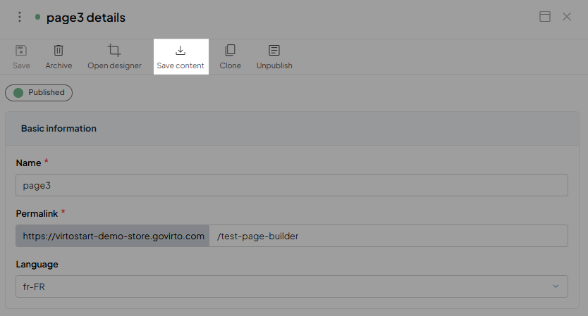{: style="display: block; margin: 0 auto;" }

A file named **{page-name}-content.json** downloads to your computer. A green notification confirms the export.

## Import page

Users can create a new page from a previously exported JSON file, i.e. import page. Use this feature to reuse page templates or restore content from a backup.

To import a page:

1. Open the Page Builder Office and select the **Draft** tab.
1. Click **Load content** in the toolbar:

    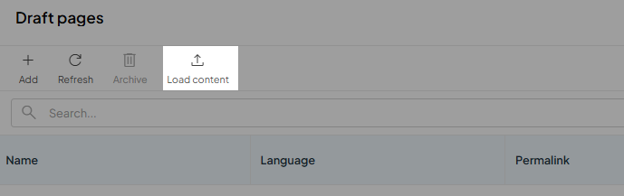{: style="display: block; margin: 0 auto;" }

1. Select a JSON file from your computer.
1. In the new page form, fill in the **Name**, **Permalink**, and **Language** fields.
1. Click **Save**.

The page is created with the imported content blocks. Open it in Designer to verify and edit the content.

## Clone page

Users can create an exact copy of a page, including all content blocks. Use this feature to modify an existing page without rebuilding it from scratch.

To clone a page:

1. Open a page from the **Draft** or **Active** tab.
1. Click **Clone** in the toolbar.

    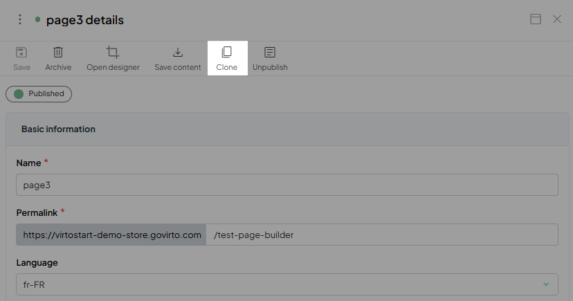{: style="display: block; margin: 0 auto;" }

    The clone's detail blade opens automatically. Cloning a clone appends another "(copy)" suffix to the name:

    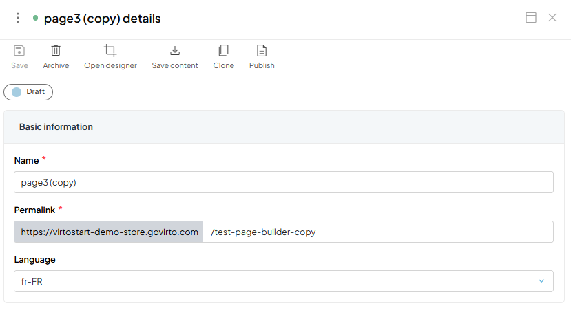{: style="display: block; margin: 0 auto;" }

1. After cloning, update the following fields:

    * **Name**: rename from {name} (copy) to the desired name.
    * **Permalink**: update from {slug}-copy to the desired URL path.
    * **Scheduling**: set new start and end dates if needed.

The cloning has been completed successfully.

## Customize pages for specific users

Users can customize pages for different organizations so that each organization’s users see only the content intended specifically for them.
For example, let's configure separate homepages so that users from the Melon organization see one version, while users from the Mercury organization see another:

  
  

    <iframe loading="lazy" class="sl-demo" src="https://virtocommerce.storylane.io/demo/rsaqdohauroh?embed=popup" name="sl-embed" allow="fullscreen" allowfullscreen style="position:absolute;top:0;left:0;width:100%!important;height:100%!important;border:1px solid rgba(63,95,172,0.35);box-shadow: 0px 0px 18px rgba(26, 19, 72, 0.15);border-radius:10px;box-sizing:border-box;"></iframe>
  

 
 

{: width="25"} [Back up and restore](../backup-and-restore.md)

 
 
********

    <a href="../manage-pages">← Managing pages via Content module </a>
    <a href="../preview-as-user">Preview as user →</a>

