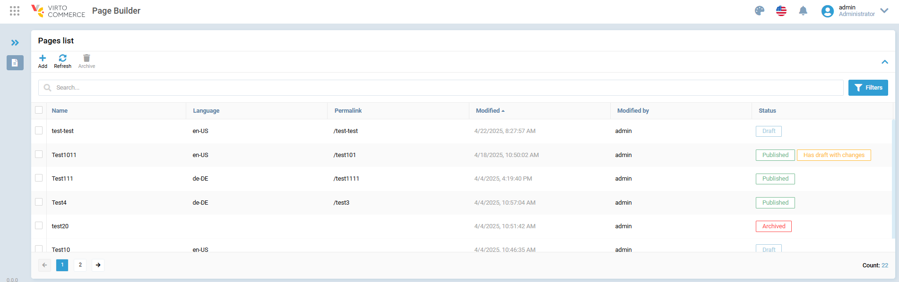
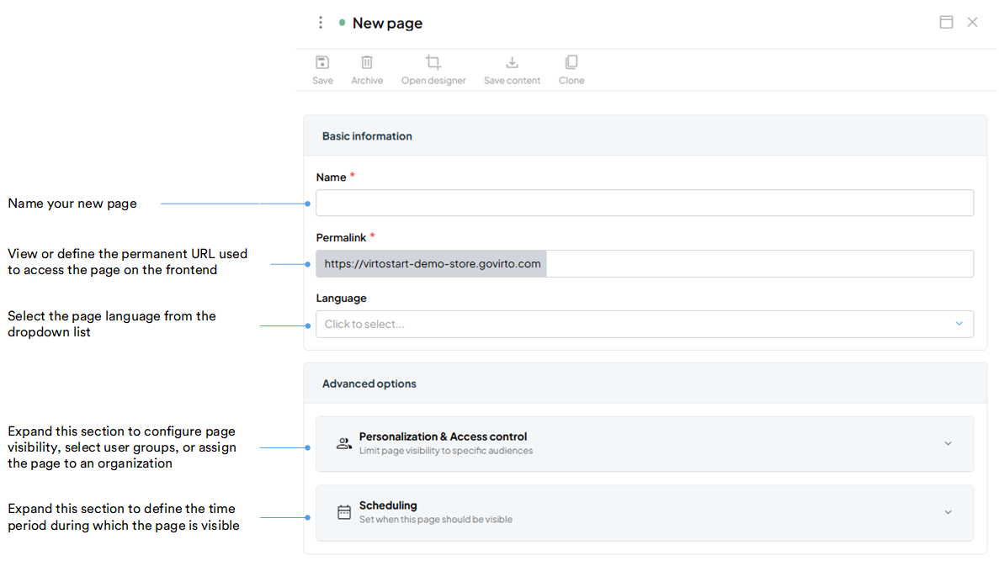
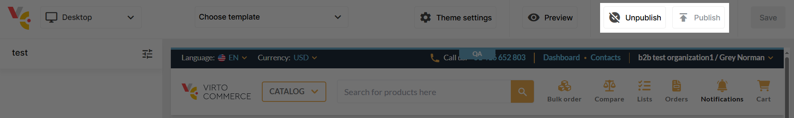
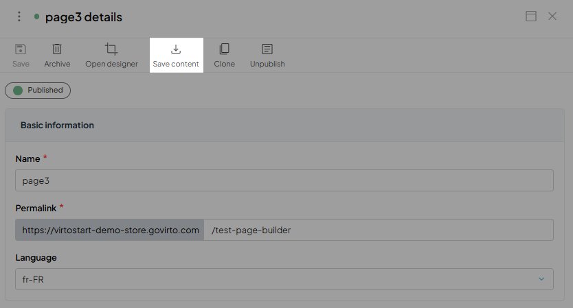
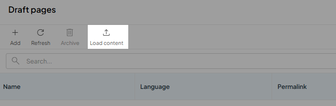
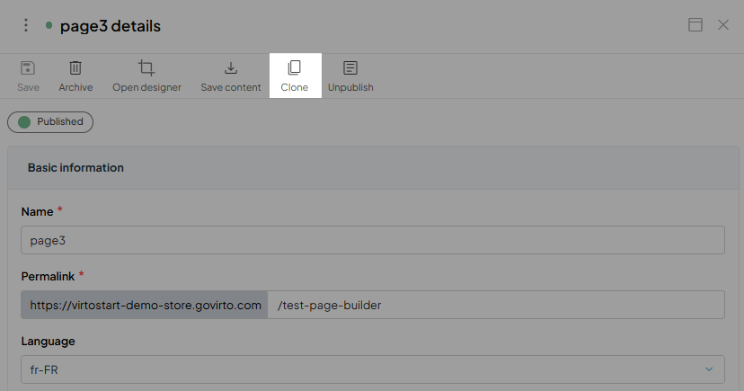
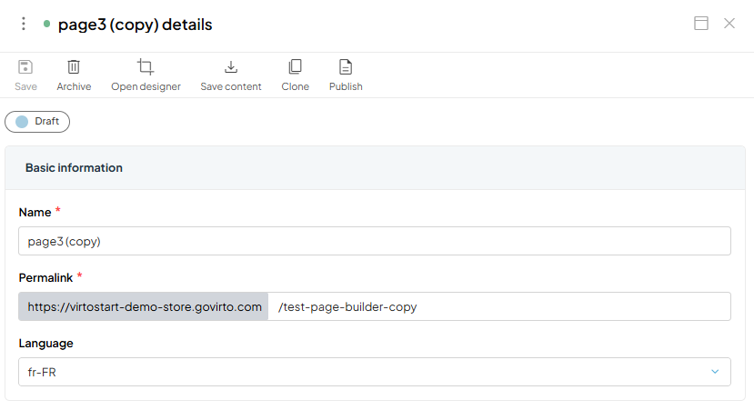
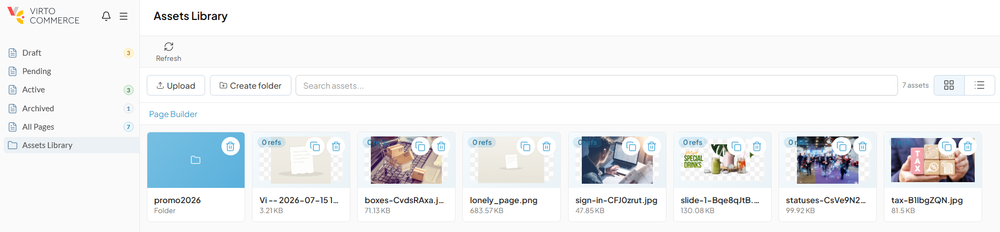
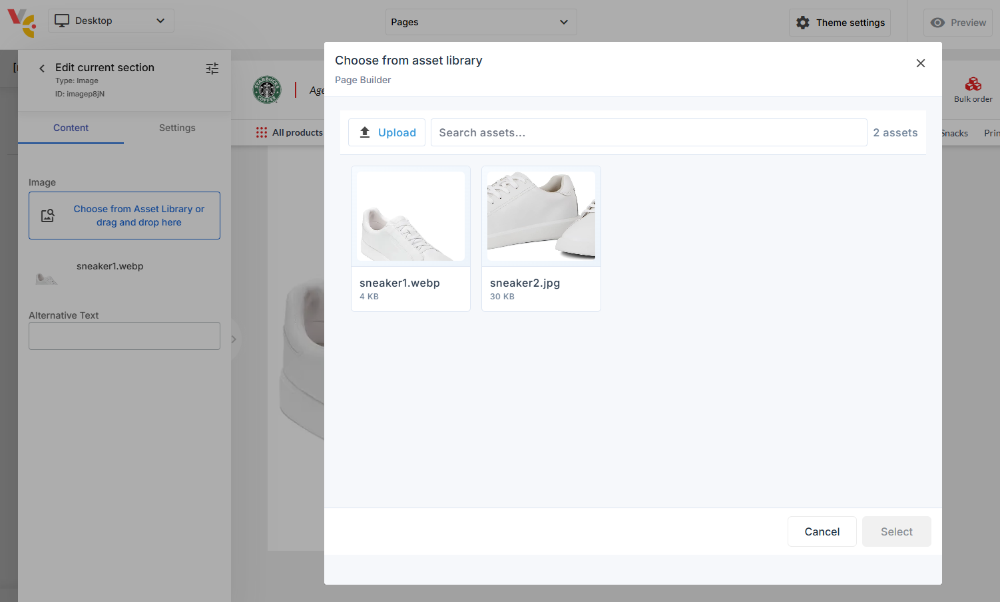
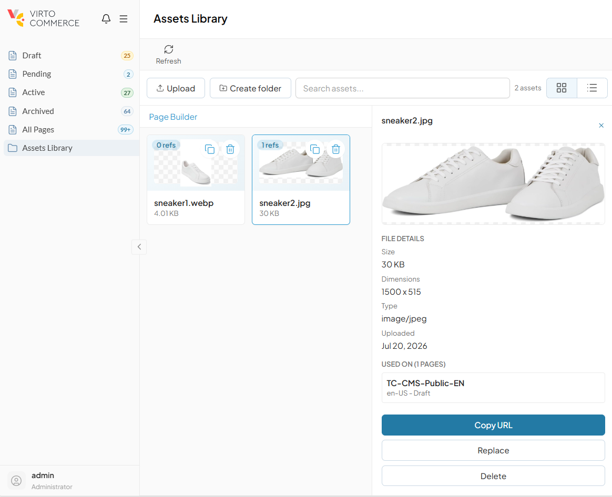

# Manage Pages via Page Builder Office

Managing pages via Page Builder Office includes:

* [Creating new pages.](#create-new-page)
* [Publishing and unpublishing pages.](#publish-or-unpublish-pages)
* [Archiving pages.](#archive-page)
* [Adding content to pages.](configure-content-block.md)
* [Exporting pages.](#export-page)
* [Importing pages.](#import-page)
* [Cloning pages.](#clone-page)
* [Customizing pages for specific users.](#customize-pages-for-specific-users)
* [Managing assets.](#manage-assets)

## Create new page

To create a new page:

1. Click **Stores** in the main menu.
1. In the next blade, select the required store.
1. In the next blade, click the **Page Builder** widget to open the Page Builder Office:

    {: style="display: block; margin: 0 auto;" }

1. Click **Add** in the toolbar.
1. In the next blade, fill in the following fields:

    {: style="display: block; margin: 0 auto;" }

1. Click **Save** in the toolbar. 

Your new page appears in the list of pages with the **Draft** status.

## Publish or unpublish pages

When your **Draft** page is ready for review, click **Publish** in the toolbar. The page is moved to the **Pending** status.

When your **Pending** page is ready to go live, click **Publish** in the toolbar. The page is moved to the **Active** status and becomes available on your store website.

If your page is outdated, click **Unpublish** in the upper right corner. The page will be removed from your store website with the **Draft** status.

Alternatively, you can publish or unpublish your page in the **Designer** mode:

{: style="display: block; margin: 0 auto;" }

## Archive page

To archive a page that is no longer needed:

1. Open your **Draft**, **Pending**, or **Active** page.
1. Click **Archive** in the toolbar.
1. Confirm your action.

The page is moved to the **Archived** pages. 

## Export page

To download a page's content as a JSON file including all blocks and their settings, i.e. to export page:

1. Open the Page Builder Office.
1. Select **Draft**, **Active**, or **Archived** pages from the left menu.
1. In the next blade, click **Save content** in the toolbar:

    {: style="display: block; margin: 0 auto;" }

A file named **{page-name}-content.json** downloads to your computer. A green notification confirms the export.

## Import page

Users can create a new page from a previously exported JSON file, i.e. import page. Use this feature to reuse page templates or restore content from a backup.

To import a page:

1. Open the Page Builder Office and click **Draft**.
1. Click **Load content** in the toolbar:

    {: style="display: block; margin: 0 auto;" }

1. Select a JSON file from your computer.
1. In the new page form, fill in the **Name**, **Permalink**, and **Language** fields.
1. Click **Save**.

The page is created with the imported content blocks. Open it in Designer to verify and edit the content.

## Clone page

Users can create an exact copy of a page, including all content blocks. Use this feature to modify an existing page without rebuilding it from scratch.

To clone a page:

1. Open **Draft**, **Active** or **Pending** pages.
1. Click **Clone** in the toolbar.

    {: style="display: block; margin: 0 auto;" }

    The clone page tops the list of **Draft** pages. Cloning a clone appends another "(copy)" suffix to the name:

    {: style="display: block; margin: 0 auto;" }

1. After cloning, update the following fields:

    * **Name**: rename from {name} (copy) to the desired name.
    * **Permalink**: update from {slug}-copy to the desired URL path.
    * **Scheduling**: set new start and end dates if needed.

The cloning has been completed successfully.

## Customize pages for specific users

Users can customize pages for different organizations so that each organization’s users see only the content intended specifically for them.
For example, let's configure separate homepages so that users from the Melon organization see one version, while users from the Mercury organization see another:

  
  

    <iframe loading="lazy" class="sl-demo" src="https://virtocommerce.storylane.io/demo/rsaqdohauroh?embed=popup" name="sl-embed" allow="fullscreen" allowfullscreen style="position:absolute;top:0;left:0;width:100%!important;height:100%!important;border:1px solid rgba(63,95,172,0.35);box-shadow: 0px 0px 18px rgba(26, 19, 72, 0.15);border-radius:10px;box-sizing:border-box;"></iframe>
  

 
 

## Manage assets

To reuse files without uploading them again and reduce duplicate media uploads, use the **Assets library**, a single, searchable library that stores all uploaded media:

1. Open the Page Builder Office:
1. From the left sidebar, select **Assets library**.
1. Upload files, organize them into folders, or delete them:

    {: style="display: block; margin: 0 auto;" }

    !!! note
        If a user is trying to upload a file with the same full name (name + extension) as an existing file in the target folder, a confirmation prompt is displayed before anything is written.

In the **Designer** mode, you can use image from the Assets Library or upload new ones:

{: style="display: block; margin: 0 auto;" }

Back in Page Builder Office, you will see the name of the page(s) where the image is used. Here, you can copy the URL, replace, or delete the image:

{: style="display: block; margin: 0 auto;" }

 
 

{: width="25"} [Back up and restore](../backup-and-restore/overview.md)

 
 
********

    <a href="../manage-pages">← Managing pages via Content module </a>
    <a href="../configure-content-block">Configure content blocks in Designer →</a>

