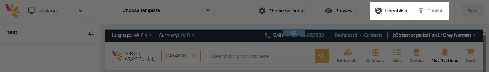

# Manage Pages via Page Builder Office

Managing pages includes:

* [Creating new pages.](#create-new-page)
* [Adding content to pages.](#add-content-to-page)
* [Publishing and unpublishing pages.](#publish-or-unpublish-pages)

## Create new page

To create a new page:

1. Click **Stores** in the main menu.
1. In the next blade, select the required store.
1. In the next blade, click on the **Page Builder** widget to open the Page Builder Office:

    {: style="display: block; margin: 0 auto;" }

1. Click **Add** in the toolbar.
1. In the next blade, fill in the following fields:

    {: style="display: block; margin: 0 auto;" }

1. Click **Save** in the toolbar. 

Your new page appears in the list of pages with the **Draft** status.

## Add content to page

To add content to your page:

1. Select your page from the list.
1. In the next blade, click **Open designer** to open your page in Page Builder.
1. In Page Builder, click **Add block** in the left menu to open the block library. The available blocks are as follows:

    {: style="display: block; margin: 0 auto;" }

1. Click on the desired block, then click **Add** to add it to the page. For example, let's add **Call to action with image** block:

    {: style="display: block; margin: 0 auto;" }

1. Click **Save** to save the changes.

The added content is saved. Continue adding content until your page is ready for publishing. 

## Publish or unpublish pages

When your page is ready for publishing, click **Publish** in the upper right corner. The page will have the extension **.page**. It will be added to your store website. 

If your page is outdated, click **Unpublish** in the upper right corner. The page will be removed from your store website.

{: style="display: block; margin: 0 auto;" }

Alternatively, you can publish your page from Page Builder Office later:

{: style="display: block; margin: 0 auto;" width="500"}

 
 
********

    <a href="../manage-pages">← Managing pages via Content module </a>
    <a href="../../pages/overview">Pages module overview →</a>

