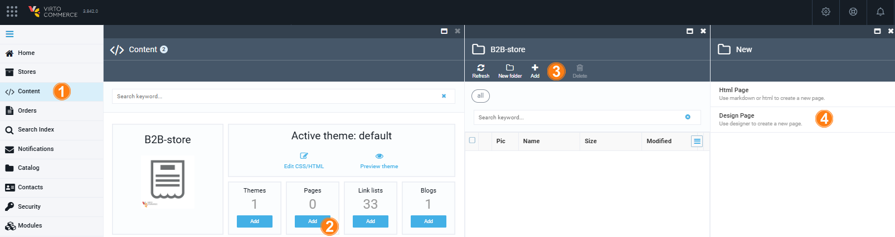
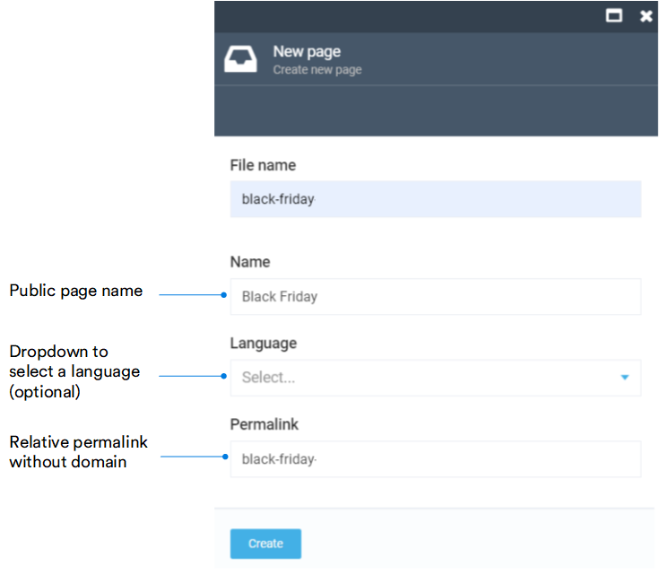
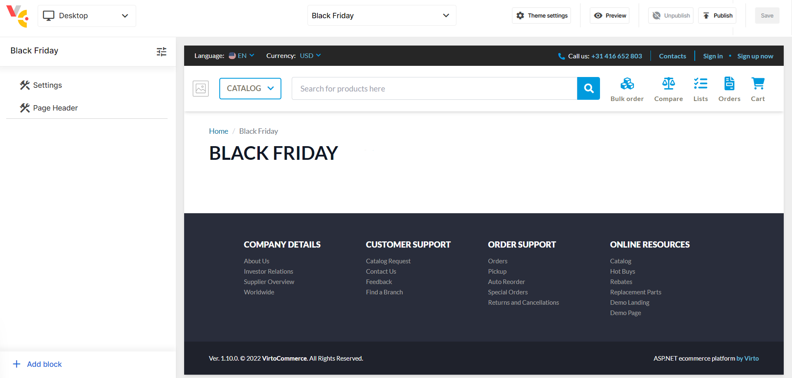
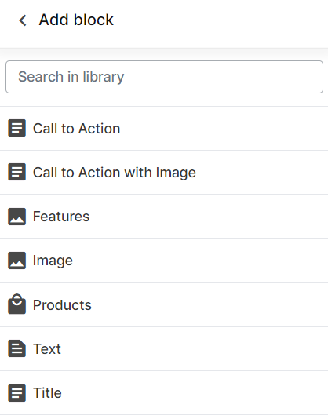
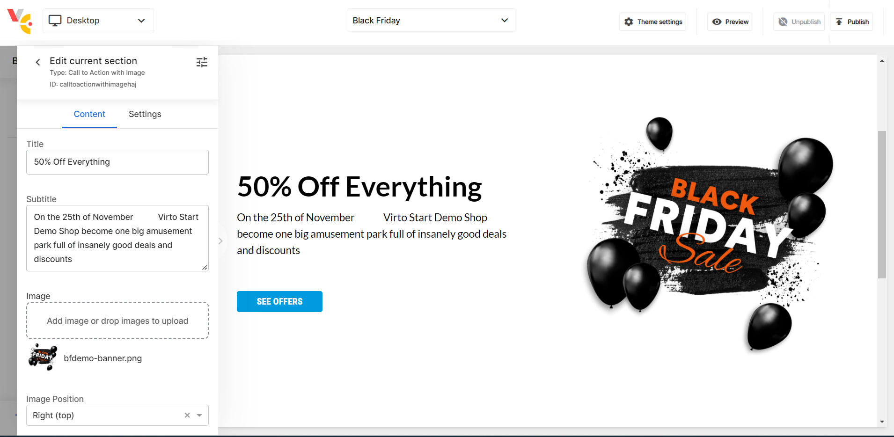
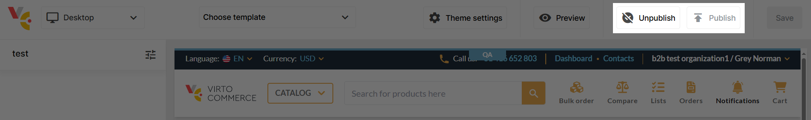

# Manage Pages in Page Builder

Managing pages in Page Builder includes:

* [Creating new pages.](manage-pages.md#create-new-page)
* [Adding content to pages.](manage-pages.md#add-content-to-page)
* [Publishing and unpublishing pages.](manage-pages.md#publish-or-unpublish-pages)

## Create New Page

To create a new page using Page Builder:

1. Click **Content** in the main menu.
1. In the next blade, find the required store and click on the **Pages** widget.
1. In the next blade, click **Add** in the toolbar. 
1. In the next blade, select **Design page**.

    

1. Fill in the next blade as follows:

    

1. Click **Create**. The Page Builder opens the newly created page in a new window. It contains uneditable header and footer by default.  

    

1. Click **Save** in the top right corner. 

The page appears in the list of pages with the **.page-draft** extension. After you [publish](manage-pages.md#publish-or-unpublish-pages) your page, it will receive the **.page** extension. 

You can open it in the browser using the specified permalink.

## Add Content to Page

To add content to your page:

1. Select your page from the list.
1. In the next blade, click **Design** to open your page in Page Builder.
1. In Page Builder, click **Add block** in the left menu to open the block library. The available blocks are as follows:

    

1. Click on the desired block, then click **Add** to add it to the page. For example, let's add **Call to action with image** block:

    

1. Click **Save** to save the changes.

The added content is saved. Continue adding content until your page is ready for publishing. 

## Publish or Unpublish Pages

When your page is ready for publishing, click **Publish** in the upper right corner. The page will have the extension **.page**. It will be added to your store website. 

If your page is no longer current, click **Unpublish** in the upper right corner. The page will be removed from your store website.

