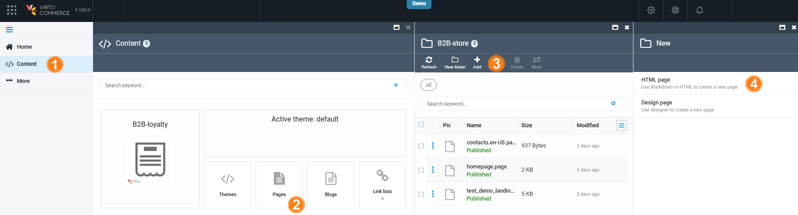

# Manage Pages via Content module

Managing pages through the Content module includes:

* [Creating new pages.](#create-new-page)
* [Adding content to pages.](#add-content-to-page)
* [Publishing and unpublishing pages.](#publish-or-unpublish-pages)

## Create new page

You can create new pages using:

* [Designer (block-based option).](#create-new-page-in-designer)
* [HTML or Markdown.](#create-new-page-in-html-or-markdown)

### Create new page in Designer

To create a new page in Designer:

1. Click **Content** in the main menu.
1. In the next blade, find the required store and click on the **Pages** widget.
1. In the next blade, click **Add** in the toolbar. 
1. In the next blade, select **Design page**.

    {: style="display: block; margin: 0 auto;" }

1. In the next blade, fill in the following fields:

    {: style="display: block; margin: 0 auto;" width="600"}

1. Click **Create**. The Page Builder opens the newly created page in a new window. It contains uneditable header and footer by default.  

    {: style="display: block; margin: 0 auto;" }

1. [Add new blocks](#add-content-to-page) to build your page.
1. Click **Save** in the top right corner. 

The page appears in the list of pages with the **.page-draft** extension. After you [publish](#publish-or-unpublish-pages) your page, it will receive the **.page** extension. 

You can open it in the browser using the specified permalink.

### Create new page in HTML or Markdown

To create a new page in HTML or Markdown:

1. Click **Content** in the main menu.
1. In the next blade, find the required store and click on the **Pages** widget.
1. In the next blade, click **Add** in the toolbar. 
1. In the next blade, select **HTML page**.

    

1. In the next blade, configure the following:

    
  
 <iframe loading="lazy" class="sl-demo" src="https://virtocommerce.storylane.io/demo/cgsl3bn1htcy?embed=inline" name="sl-embed" allow="fullscreen" allowfullscreen style="position:absolute;top:0;left:0;width:100%!important;height:100%!important;border:1px solid rgba(63,95,172,0.35);box-shadow: 0px 0px 18px rgba(26, 19, 72, 0.15);border-radius:10px;box-sizing:border-box;"></iframe> 
 

Now, you can [publish your page](#publish-or-unpublish-pages).

## Add content to page

To add content to your page:

1. Select your page from the list.
1. In the next blade, click **Design** to open your page in Page Builder.
1. In Page Builder, click **Add block** in the left menu to open the block library. The available blocks are as follows:

    {: style="display: block; margin: 0 auto;" }

    !!! note 
    
        To add products to the **Predefined products** or **Products carousel** blocks, enter the products' SKUs:

        {: style="display: block; margin: 0 auto;" }
    
1. Click on the desired block, then click **Add** to add it to the page. For example, let's add **Call to action with image** block:

    {: style="display: block; margin: 0 auto;" }

1. Click **Save** to save the changes.

The added content is saved. Continue adding content until your page is ready for publishing. 

## Publish or unpublish pages

When your page is ready for publishing, click **Publish** in the upper right corner. The page will have the extension **.page**. It will be added to your store website. 

If your page is outdated, click **Unpublish** in the upper right corner. The page will be removed from your store website.

{: style="display: block; margin: 0 auto;" }

Alternatively, you can publish or unpublish your page later in from the Content module:

{: style="display: block; margin: 0 auto;" }

 
 
********

    <a href="../overview">← Page Builder module overview</a>
    <a href="../manage-pages-via-office">Managing pages via Page Builder office →</a>

