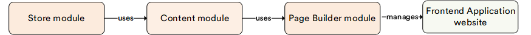

# Overview

The **Page Builder** module allows you to create e-commerce pages from blocks and edit them using a visual editor. Unlike the Content module, which only supports creating and editing pages using Markdown and HTML, the Page Builder module provides a more intuitive, visual approach. However, it is required to have the [Content module](../content/overview.md#installation) installed first, as the Page Builder module is accessed through the Content module interface. 

[Contact us to install PageBuilder](https://virtocommerce.com/contact-us)

The Virto Commerce Page Builder module offers:

* Seamless integration into your unique design.
* A configurable set of favorite blocks.
* An extensive block library with minimal coding, allowing new block creation with a flexible JSON schema.
* Easy integration with your existing sites and apps.
* Compatibility with DevOps.
* Support for a streamlined publishing process.

## Key features

The diagram below illustrates the relationships within the Virto Commerce Content Management System:

{: style="display: block; margin: 0 auto;" }

With the PageBuilder module, you can

* Visually build a new landing page without a developer.
* Customize the look of your site.
* Customize e-commerce pages with a preview feature.
* Preview content before publishing.
* Access a block library for different page elements.
* Implement SEO by design for better search engine visibility.
* Ensure mobile-friendliness through design.
* Manage blocks with drag and drop, copy, paste, hide, and more.
* Seamlessly integrate with Virto Frontend Application.
* Leverage the native extensibility framework.
* Set permissions to control access and editing capabilities.

 
 
********

    <a href="../../notifications/overview">← Notifications module overview</a>
    <a href="../manage-pages">Managing pages via Content module →</a>

