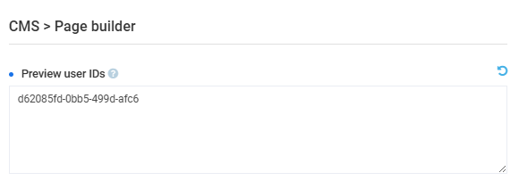

# Page Builder

To configure Page Builder settings:

1. Open **Stores** from the main menu.
1. In the next blade, select  your store.
1. In the next blade, click on the **Settings** widget.
1. Find **Page Builder** settings in the left panel and configure the following:

    {: style="display: block; margin: 0 auto;" }

1. Click **OK**, then **Save** in the toolbar to save the changes.

The modifications have been applied.

 
 
********

    <a href="../preview-as-user">← Preview pages as user</a>
    <a href="../../pages/overview">Pages module overview →</a>

