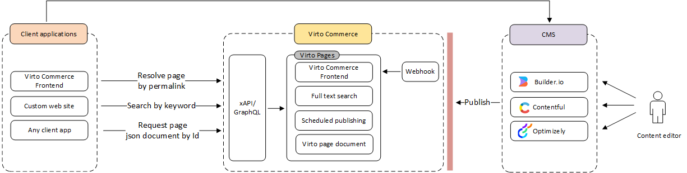

# Overview

The **Pages** module is a solution designed to connect different CMSs seamlessly within Virto Commerce. It offers a CMS-agnostic architecture, enabling users to manage public, private, and personalized pages effectively. Once pages are published, they are stored within Virto Pages, making the CMS optional after the design phase. This approach allows for flexibility in detaching, replacing, or using multiple CMS platforms simultaneously for scenarios like landing pages, blogs, and more.

## Key features

* **CMS-agnostic architecture**: CMS is required only during the design phase. Once published, content is stored in Virto Pages for use without real-time CMS dependency.
* **Hosted content pages**: Save pages retrieved from a CMS into the Virto platform for efficient management.
* **Content scenarios**:
    * **Public pages**: Allow access to all users.
    * **Private pages**: Restrict access to unauthorized users.
    * **Personalized pages**: Tailor content for specific user groups.
    * **Scheduled publishing**: Define start and end dates for content visibility.
    * **Pages returned by permalink**: Access pages easily using unique identifiers or user-friendly URLs.
    * **Pages returned by ID**: Access pages easily using unique identifiers or user-friendly URLs.
* **Full-text search capabilities**: Quickly search and retrieve pages by keyword.

## Supported CMS platforms

* **Builder.io**: Fully supported for integration.
* **Contentful**: Coming soon.
* **Optimizely**: Coming soon.
* [Virto Page Builder.](../page-builder/overview.md)

## Architecture

{: style="display: block; margin: 0 auto;" }

The Virto Pages module employs an event-driven architecture to ensure efficient content management and retrieval. The key components include:

* **Content storage**: Pages are stored offline in an index, ensuring quick access and rendering without live CMS dependency.
* **Event handling**: Content updates trigger events to update, index, or remove pages as necessary.
* **Frontend integration**: Pages are resolved by their permalink (slug) and served  from the offline index for rendering.
* **Unified page document and API**: Unified Page Document and API allow access to pages that are created by different CMS.

## Scenarios

The Virto Pages module supports end-to-end content workflows:

* **Design time**: Integrate with a CMS to create and design pages, preparing them for publishing.
* **Publishing**: Publish pages to Virto Pages, removing dependency on the CMS afterward.
* **Rendering**: Render pages via permalink or unique ID, ensuring fast, reliable performance. Pages can also be searched by keywords for easy retrieval.

 
 
********

    <a href="../../page-builder/overview">← Page Builder module overview</a>
    <a href="../enabling-pages">Enabling Pages →</a>

