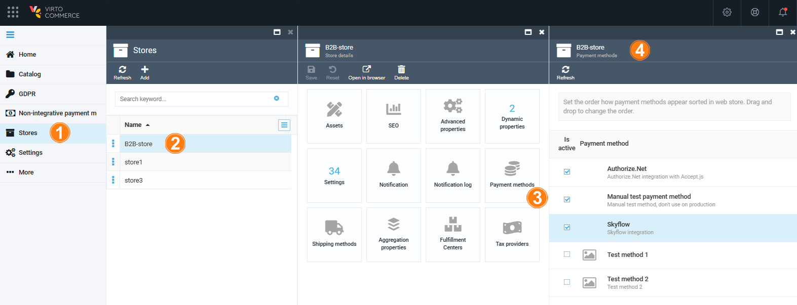

# Manage Payment Methods

To view the available payment methods:

1. Click **Stores** in the main menu.
1. In the next blade, select the required store.
1. In the next **Store details** blade, click on the **Payment methods** widget.
1. The next blade displays the list of available payment methods. 

{: width="20"} [Manage Authorize.net payment method](../authorize-net/manage-authorize-net-module.md)

{: width="20"} [Manage CyberSource payment method](../cybersource/manage-cybersource.md)

{: width="20"} [Manage Datatrans payment method](../datatrans/manage-datatrans.md)

{: width="20"} [Manage Skyflow payment method](../skyflow/manage-skyflow-module.md)

{: width="20"} [Manage Loyalty programs](../loyalty/enable-and-configure-loyalty-programs.md)

 
 
********

    <a href="../overview">← Payment module overview</a>
    <a href="../settings">Settings →</a>

