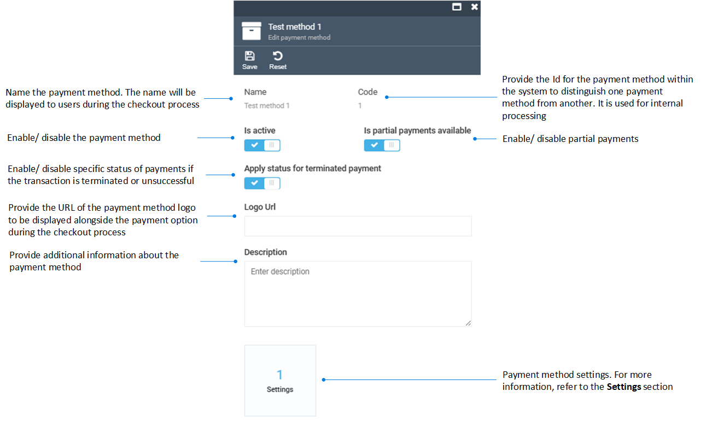

# Manage Payment Methods

Managing payment methods includes:

* [Viewing available payment methods.](managing-payment-methods.md#view-available-payment-methods)
* [Editing payment methods.](managing-payment-methods.md#edit-payment-methods)

## View available payment methods

To view the available payment methods:

1. Click **Stores** in the main menu.
1. In the next blade, select the required store.
1. In the next **Store details** blade, click on the **Payment methods** widget.
1. The next blade displays the list of available payment methods.

## Edit payment methods

To edit a payment method:

1. Complete steps 1-4 from the instruction above.
1. Select the required payment method from the list.
1. In the next blade, fill in the following fields:

    

1. Click **Save** in the toolbar to save the changes.

Your modifications have been applied.

 
 
********

    <a href="../overview">← Payment module overview</a>
    <a href="../settings">Settings →</a>

