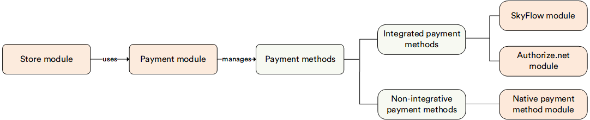

# Overview

With the **Payment** module, you can:

* Extend payment provider list with custom providers.
* Provide an interface for managing these payment providers.
* Register payment methods using a code.
* Edit payment method settings.
* Connect payment methods to a store.

## Key features

Although the **Payment** module does not have its own user interface, you need to have it installed to manage payment methods via the **Store** module. Installing **Payment** module adds the **Payment methods** widget to the **Stores** module.

The diagram below illustrates the interconnections among the Payment and Stores modules:
 
 

{: width="25"} [Native Payment Methods](../native-payment-methods/overview.md)
