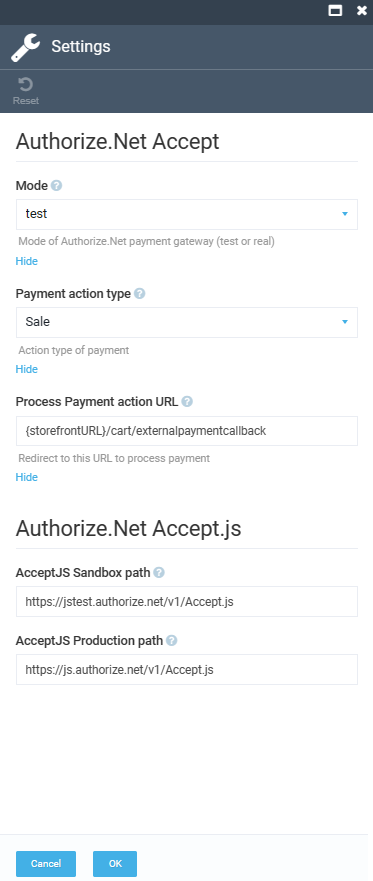

# Settings

To configure the Payment module settings:

1. Click **Stores** in the main menu.
1. In the next blade, select the required store.
1. In the next **Store details** blade, click on the **Payment methods** widget.
1. The next blade diplays the list of available payment methods. Select the required method.
1. In the next blade, click on the **Settings** widget. 
1. The next blade displays settings of the selected payment method. For example, the Authorize.Net settings are as follows:

    

1. Click **OK** to save the changes.

The payment method settings have been configured.

{: width="25"} [Native Payment Methods Settings](../native-payment-methods/settings.md)
