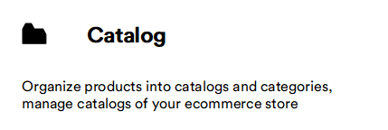
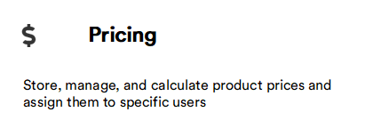
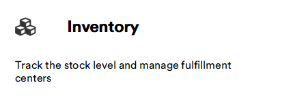
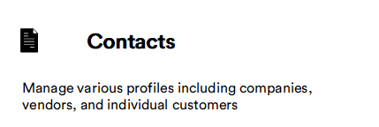
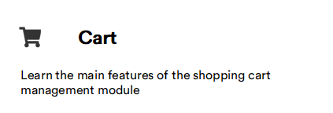
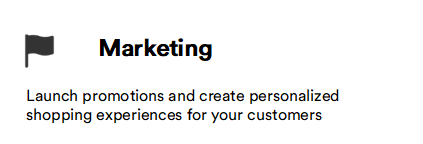
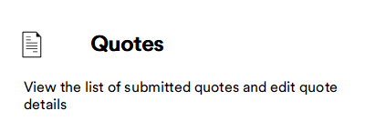
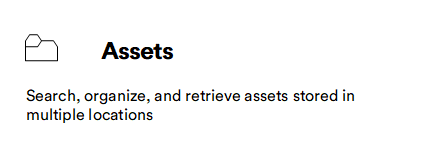

# Overview

Learn more about the features of Virto Commerce modules. Below is a list of core modules that represent the basic functionality of the Platform:

|Item|Description|
|---|---|
|  | <ul><li> [Create catalogs](catalog/add-new-catalog.md) and [import products, prices, and stock to them](catalog/import-products-to-catalog.md)</li><li> [Manage product variations](catalog/managing-product-variations.md) and [availability ](catalog/setting-product-availability.md) </li> <li>[Index catalogs](catalog/managing-search-index.md)</li></ul>|
|  | <ul><li> [Add new store](store/adding-new-store.md)</li><li> [Set SEO for your store](store/configuring-store.md#seo) </li> <li>[Manage fulfillment centers](store/configuring-store.md#fulfillment-centers)</li> <li>[Manage products reviews and other settings](store/settings.md)</li></ul>|
|  |  <ul><li> [Create price lists](pricing/creating-new-price-list.md)</li><li> [Edit product prices](pricing/creating-new-price-list.md#add-and-edit-product-prices) </li> <li>[Link price lists to catalogs and stores](pricing/adding-new-assignment.md)</li></ul>|
|  |  <ul><li> [Track and manage product's inventory](inventory/managing-inventory.md)</li><li> [Add and edit fulfillments centers](inventory/managing-fulfillment-centers.md#add-and-edit-fulfillment-center) </li> <li>[Enable event-based indexing for inventory entities](inventory/settings.md#search-settings)</li></ul>|
|  | <ul><li> [View order information](order-management/main-objects.md)</li><li> [Track order changes](order-management/tracking-order-changes.md) </li> <li>[Manage returns](order-management/managing-returns.md)</li> <li>[Send order information to AvaTax](order-management/sending-order-information-to-avatax.md)</li></ul>|
|  | <ul><li> [Add and edit contacts](contacts/managing-contacts.md)</li><li> [Export and import contacts](contacts/managing-contacts.md#export-contacts) </li> <li>[Filter and search contacts](contacts/filtering-options.md)</li> <li>[Assign multiple organizations to contacts and employees](contacts/managing-contacts.md#assign-multiple-organizations-to-contacts-and-employees)</li> </ul>|
|  |  <ul><li> [Discover cart key features](cart/overview.md#key-features)</li><li> [Track and remove obsolete carts](cart/settings.md) </li> </ul>|
|  | <ul><li> [Launch a promotion](marketing/managing-promotions.md#create-new-promotion)</li><li> [Create coupons and gift cards](marketing/managing-promotions.md#create-coupons-and-gift-cards) </li> <li>[Choose between best reward and stackable policies](modules-installation.md)</li> <li>[Customize your campaign to target specific customers](marketing/promotion-rules.md)</li></ul>|
|  |  <ul><li> [View requested quotes](quotes/manage-quotes.md#view-quotes-list-and-quote-details)</li> <li> [Edit quote details](quotes/manage-quotes.md#edit-quote-details)</li> <li> [Submit your proposal](quotes/manage-quotes.md#edit-quote-details) </li> </ul>|
|  |  <ul><li> [Upload files](assets/managing-assets.md#upload-files)</li><li> [Organize files](assets/managing-assets.md#organize-files) </li> <li>[Search files](assets/managing-assets.md#search-files)</li> </ul>|
|  |  <ul><li> [Activate various themes](content/managing-themes.md) </li><li> [Create and edit pages](content/managing-pages.md), [link lists](content/managing-linklists.md), [blogs with unlimited number of posts](content/managing-blogs.md)</li> <li> [Manage content with PageBuilder](page-builder/manage-pages.md) or [Builder.io](integrations/builder-io/use-builder-io.md) </li> </ul>|
