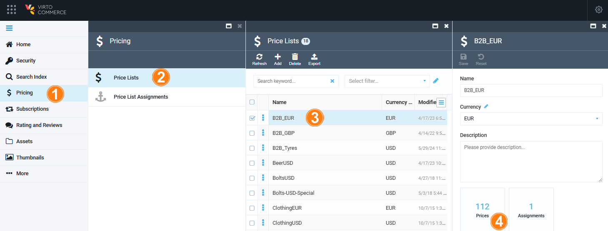
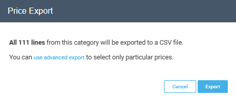
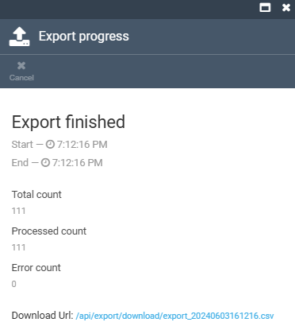
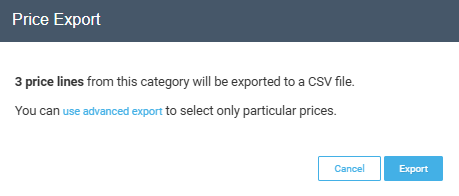
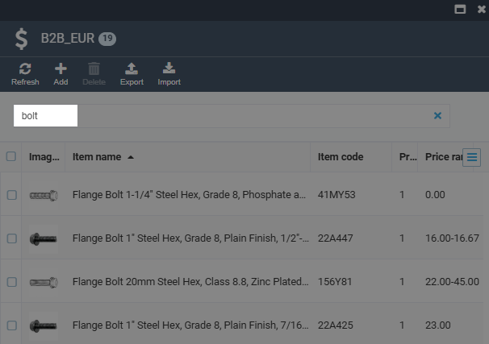
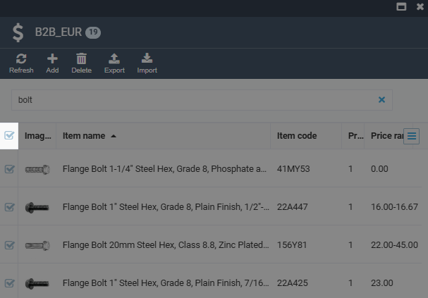
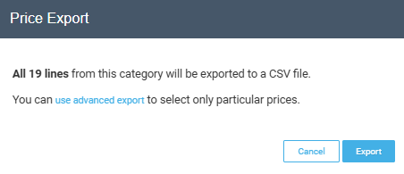
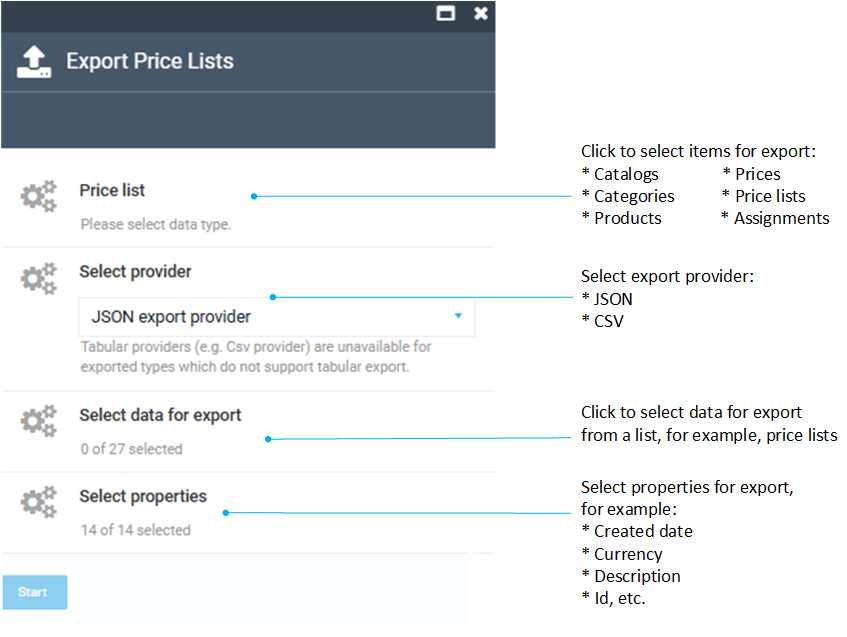
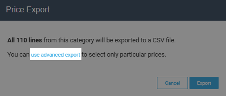

# Export Price Lists

There are the following options for exporting price lists:

* [Exporting all prices from a price list.](exporting-price-lists.md#export-all-prices-from-price-list)
* [Exporting selected prices from a price list.](exporting-price-lists.md#export-selected-prices-from-price-list)
* [Exporting prices from a filtered price list.](exporting-price-lists.md#export-all-prices-from-filtered-price-list)
* [Advanced exporting.](exporting-price-lists.md#use-advanced-export)

To start exporting:

1. Click **Pricing** in the main menu.
1. In the next blade, click **Price lists**.
1. In the next blade, check the price list to export.
1. In the next blade, click on the **Prices** widget.

## Export all prices from price list

To export all prices from a price list:

1. Complete steps 1-4 from the instruction above.
1. In the top toolbar, click **Export** to start exporting.
1. You will see a notification, that all the lines in the selected category will be exported to a CSV file:

    

1. Click **Export**. You can see the export progress in the next blade. When the export is complete, you will see a link to download the generated CSV file:

    

All prices from the price list have been successfully exported to a CSV file. 

## Export selected prices from price list

To export selected prices from a price list:

1. Complete steps 1-4 from the instruction above.
1. Check the items you need to export.
1. Click **Export** in the top toolbar to start exporting. 
1. You will see a notification, that the selected lines will be exported to a CSV file:

    

1. Click **Export**. You can see the export progress in the next blade. When the export is complete, you will see a link to download the generated CSV file.

The selected prices have been exported to a CSV file.

## Export all prices from filtered price list

To export all prices from a filtered price list:

1. Complete steps 1-4 from the instruction above.
1. Check the items you need to export.
1. Filter the list by entering a keyword to the search field, for example, **bolts**:

    

1. Bulk select all the filtered prices by checking the top check:

    

1. Click **Export** in the top toolbar to start exporting.
1. You will see a notification, that the selected lines will be exported to a CSV file:

    

1. Click **Export**. You can see the export progress in the next blade. When the export is complete, you will see a link to download the generated CSV file:

The prices from a filtered price list have been exported to a CSV file.

## Use advanced export

To customize exported information to your needs, use **advanced export**:

1. Complete the steps 1-2 from the instruction above.
1. In the next blade, click **Export** in the top toolbar.
1. In the next blade, you will see the following filters to apply:

    

1. Click **Start** to start exporting.
1. You can see the export progress in the next blade. When the export is complete, you will see a link to download the generated CSV file.

!!! note
    You can apply advanced filters to the first 3 export options described above. Click **Use advanced export** in the notification window:
    
    

The required items have been exported to a CSV file.

 
 
********

    <a href="../mapping-csv-files">← Mapping CSV files</a>
    <a href="../importing-price-lists">Importing price lists →</a>

