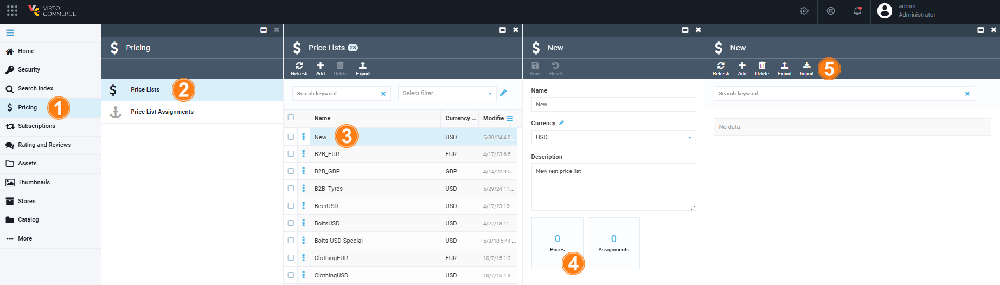
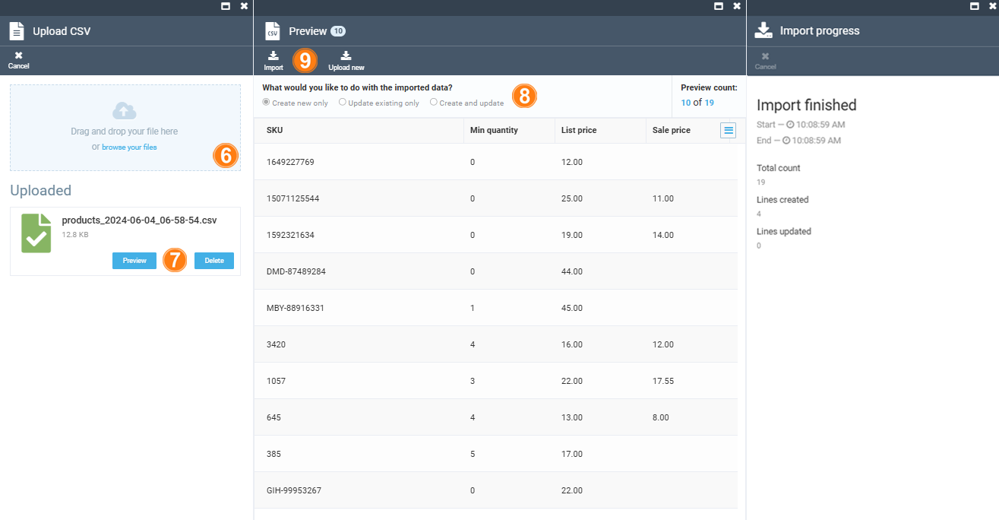
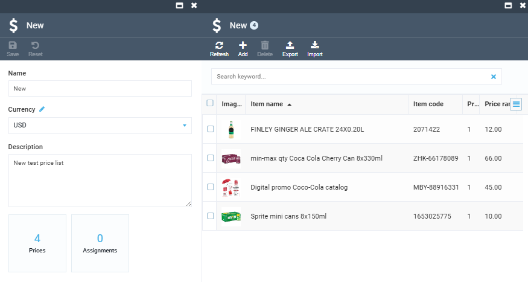

# Import Price List

After [creating a price list](../pricing/creating-new-price-list.md), you can fill it in using the **import price list** option:

1. Click **Pricing** in the main menu. 
1. In the next blade, click **Price lists**.
1. In the next blade, select the price list you want to fill with information. 
1. In the next blade, click on the **Prices** widget.
1. In the next blade, click **Import** in the top toolbar.

    

1. Drag and drop or browse your CSV file in the next blade. 

    !!! note
        The **SKU**, **Min quantity**, **List price**, and **Sale price** fields are required. 

    !!! note
        Use semicolon as a delimeter in your CSV file.

1. After your file has been uploaded, click **Preview**.
1. In the **Preview** blade you will see the list of uploaded items. Select your further action:

    * Create new only.
    * Update existing only.
    * Create and update.

1. In the top toolbar, click **Import**. You can see the import progress in the next blade.

    

1. When the import is complete, click **Refresh** in the price list blade.

    

Your price list has been filled with information. 
