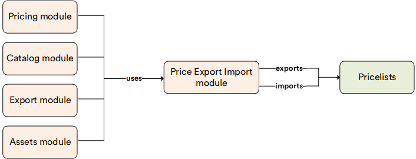

# Price Export Import Module

To transfer large amounts of pricing information between Virto Commerce and another system, use a specially formatted spreadsheet to import or export the data. Virto Commerce uses CSV (semicolon-separated value) files for these bulk tasks.

The goal of this module is to provide a convenient way for non-technical business users (such as category managers) who work with prices on a daily basis and may not understand database structures to manage price exports and imports.

!!! note
    If you want to automate the transfer of information from a third-party system, such as ERP, see the API, Integration Middleware approach, and Azure Logic Apps connectors.

## Key features

* Exporting two price lists for comparing.
* Changing multiple prices in the price list of few hundreds of records in the price list.
* Making bulk price updates (for example, +5% for everything) for a price list.
* Adding prices for a batch of new products added to the catalog.

The diagram below illustrates the Price Export Import module functionality:

