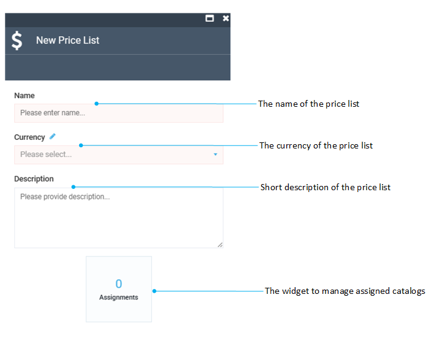

# Manage Price Lists

Price lists are containers for different product prices. They can be useful when you want to store prices for items in a particular category in a single place.

Managing price lists includes:

* [Creating new price list.](creating-new-price-list.md#create-new-price-list)
* [Deleting price lists.](creating-new-price-list.md#delete-price-list)
* [Adding products to price list.](creating-new-price-list.md#add-products-to-price-list)
* [Adding and editing product prices.](creating-new-price-list.md#add-and-edit-product-prices)

## Create new price list

To create a new price list:

1. Click **Pricing** in the main menu.
1. In the next blade, click **Price lists**.
1. In the next blade, click **Add** in the toolbar to open the **New Price List** blade.
1. The following blade appears:

	

	Add:

	* Name.
	* Currency.
	* Short description (optional).

	You will need the Assignments widget later when [configuring price list assignments](adding-new-assignment.md), if any.   

1. Click **Create**.

Your new price list appears in the list.

## Delete price list

To delete a price list:

1. Click **Pricing** in the main menu.
1. Check the price list(s) you want to delete.
1. Click **Delete** in the toolbar.
1. Confirm the deletion.

The price list has been deleted.

## Add products to price list

To add prices:

1. Select your new price list.
1. In the next blade, click on the **Prices** widget.
1. In the next blade, click **Add** to select items for pricing.

	

1. In the next blade, select the category you want to add the product prices from.
1. In the **Select catalog items...** blade, check the products you need.
	
	!!! note
		For more information on importing price lists, refer to the [Import price list](../price-export-import/importing-price-lists.md) article.

1. Click **Add selected** to add the prices of the selected products to your price list.

	

You can see the added prices in the **Prices** widget.

## Add and edit product prices

If some products either do not have assigned prices when you add them to your price list, or the specific price you currently need is missing, you can both edit the existing prices and add new ones.

To start editing or adding a price:

1. Click the product in your price list to open the price editing blade:
1. Click the existing price or add a new one by clicking **Add** in the toolbar.
1. Edit the **List price**, **Sale price**, and **Minimum quantity**, which cannot be less than 1 by default.
1. Click **Save** to save the changes.

	

The modifications have been saved.

 
 
********

    <a href="../overview">← Pricing module overview</a>
    <a href="../adding-new-assignment">Managing price list assignments →</a>

