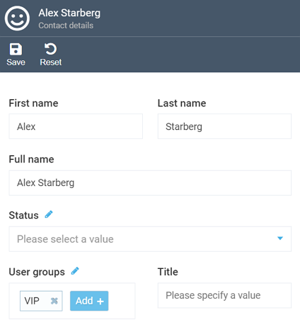

# Enable Special Prices for Specific Users

In this example, we will configure Virto Platform to display a discounted price for loyal customers.
Let's assume you have an item you want to sell at a discounted price to your loyal customers as a reward for their loyalty. 

By default, the items we would like to sell to loyal customers with a discount (printers in our example) have the same price for everyone who visits the store:

{: width="1100"}

To enable the special prices:

1. [Create a user group](../catalog-personalization/user-groups.md#add-new-user-group).
1. [Add all required contacts to this group](../contacts/managing-contacts.md#add-contacts). You can easily create as many contacts as you need. In our example, we created a group called **VIP** and assigned various contacts to it, including Alex Starberg, who will be our loyal customer in the example:

    {: width="350"}

1. [Create a new price list](creating-new-price-list.md). In this example, we create the **Loyal customers only** price list.

1. [Provide special prices](creating-new-price-list.md#add-products-to-price-list) for the products in question. In our example, we want to offer printers at $50 per item:

    

1. [Create a dedicated price list assignment](adding-new-assignment.md) and attach the price list you have just created:

1.  In the **User group contains...** menu, type **VIP** to assign the created price list to the user group that contains **VIP**. 

1.  Click **Create** to save the changes.

    {: width="350"}

Now, if anyone who is not included into the **VIP** group visits our store, they will see the regular price for the item in question, as shown above. However, once Alex Starberg, our loyal customer, logs into the store, he will get his discount:

{: width="1100"}

{: width="25"} [How to show catalog items for specific users](../catalog-personalization/example.md)
