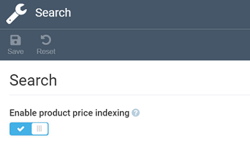

# Settings

The Pricing module settings include:

* [General settings.](managing-pricing-module-settings.md#general-settings)
* [Search settings.](managing-pricing-module-settings.md#search-settings)

## General settings

To configure general settings:

1. Click **Settings** in the main menu.

1. Type **Pricing** to find the settings related to the module.

1. Select **General** to:
    * Configure the page size for export or import.
    * Enable/ disable logging of pricing changes.
    * Enable/ disable the event-based indexing.

	{: style="display: block; margin: 0 auto;" }

1. Click **Save** in the toolbar to save the changes.

The general settings have been modified.

## Search settings

To configure search settings: 

1. Click **Settings** in the main menu.

1. Type **Pricing** to find the settings related to the module.

1. Select **Search** to enable or disable price indexing.

	{: style="display: block; margin: 0 auto;" }

1. Click **Save** in the toolbar to save the changes.

The search settings have been modified.

 
 
********

    <a href="../viewing-price-list-in-catalog">← Viewing prices in catalog</a>
    <a href="../troubleshooting-guide">Troubleshooting →</a>

