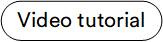

# Overview

The **Pricing** module is designed for storing, managing, and calculating product prices.

The Pricing module includes the following entities:

* Price lists that store prices in a single currency.
* Price list assignments that enable associating specific price lists with catalogs based on the relevant rules and conditions.

## Key features 

The diagram below illustrates the interconnections among various key entities within the Pricing module:

{: style="display: block; margin: 0 auto;" }

With the Pricing module, you can:

* [Create new price lists.](creating-new-price-list.md)
* [Add products to new price list.](creating-new-price-list.md#add-products-to-price-list)    
* [View price list via the Catalog module.](viewing-price-list-in-catalog.md)
* [Add new price list assignment.](adding-new-assignment.md)
* [Configure the Pricing module.](managing-pricing-module-settings.md)
* [Export prices and price list assignments.](export-functionality.md)
* [Troubleshoot problems with incorrect prices in the Frontend Application.](troubleshooting-guide.md)

 
 
********

    <a href="../../store/overview">← Store module overview</a>
    <a href="../creating-new-price-list">Managing price lists →</a>

