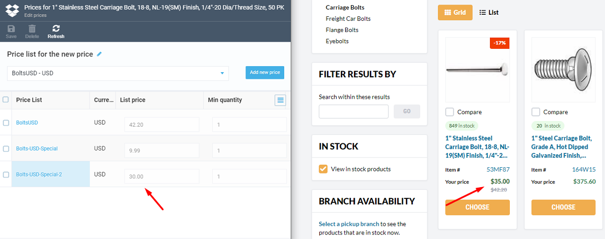

# Troubleshooting

As the Pricing module allows for the addition of multiple prices of the same currency to a single product, sometimes the prices shown in the Frontend Application catalog aren't what you expect. For example, you add a new price to your product, but Frontend Application presents it incorrectly:

Here are steps to help you determine why the correct price isn't showing up:

* In the **Catalog** module, open the **Price** widget of the product with incorrect price. Make sure the new price is included in the Price list.
* In the **Pricing** module, select **Price List Assignments**. Make sure the price meets the following conditions in its assignment:
    * The assignment has the highest **Priority** compared to other price list assignments. The price with the top priority assignment is used first.
    * The assignment references the correct **Catalog**. For instance, if your Frontend Application is set up to work with a virtual catalog, but the assignment points to a physical one (where the product is actually located), the price won't be displayed. To avoid confusion, consider using the **Store** assignment instead of **Catalog**.
    * If there are any specific conditions for the assignment, ensure they apply. For example, if the assignment relies on the **User group contains** condition, make sure the customer is added to the appropriate user group.
    * Rebuild the product index and recheck the Frontend Application price.

 
 
********

    <a href="../managing-pricing-module-settings">← Pricing module settings</a>
    <a href="../example">Enabling special prices for specific users →</a>

