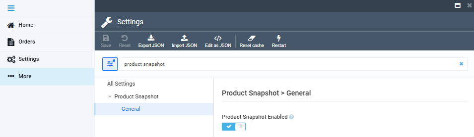

# Enable Product Snapshot

To enable product snapshot feature:

1. Click **Settings** in the main menu.
1. In the search field of the next blade, type **Product snapshot** to find the settings related to the module.
1. Select **General**.
1. In the next blade, turn the product snapshot feature to on:

 
 
********

    <a href="../viewing-products-snapshot">← Viewing product snapshot</a>
    <a href="../../push-messages/overview">Push messages module overview →</a>

