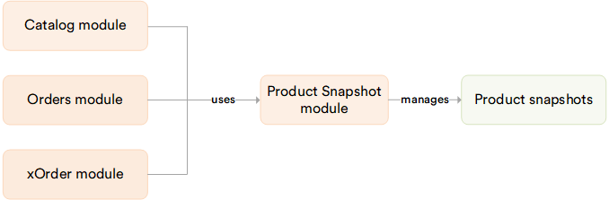

# Overview

The **Product Snapshot** module captures and stores product information at the moment an order is created. This ensures that customers and store operators always have access to the exact product details (prices, properties, images, descriptions) that were valid at the time of purchase, even if the product catalog is later modified or products are deleted.

A category manager updates or removes a product from the catalog, but existing orders still display the original product information through snapshots. If a snapshot does not exist for a given product, the system falls back to loading the current product data from the catalog.

## Key features

The diagram below illustrates the Product Snapshot module functionality:

{: style="display: block; margin: 0 auto;" }

With the snapshot module, users get:

* **Automatic snapshot creation**: Creates product snapshots when a new order is placed.
* **Full product data capture**: Stores product info, assets, properties, and editorial reviews as a serialized JSON document.
* **Configurability**: Snapshot creation can be enabled or disabled through Platform setting.
* **Granular permissions**: Access, create, read, update, and delete operations are controlled by dedicated permissions.
* **Async snapshot creation (coming soon)**: snapshot generation runs in the background to avoid impacting order processing performance. If snapshot creation fails, it is logged but does not block the order from being created.

 
{: width="20"} [Product Snapshot architecture and extensibility](/platform/developer-guide/latest/Tutorials-and-How-tos/How-tos/product-snapshot/)

 
 
********

    <a href="../../price-export-import/overview">← Price Export-Import module overview</a>
    <a href="../viewing-products-snapshot">Using products snapshot →</a>

