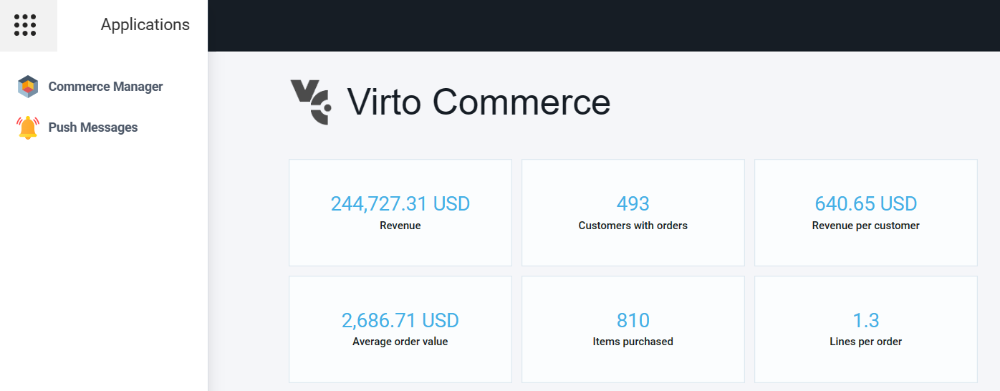
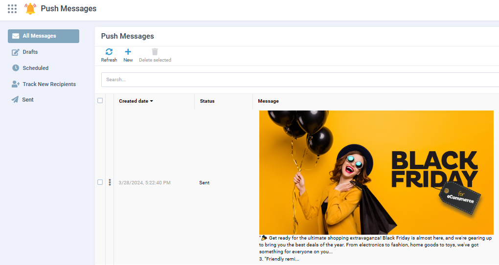
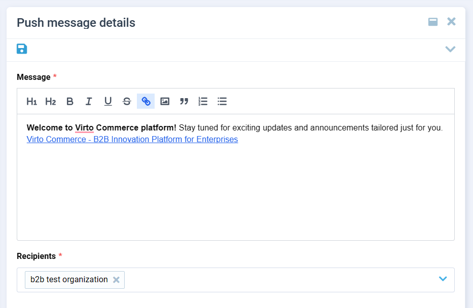
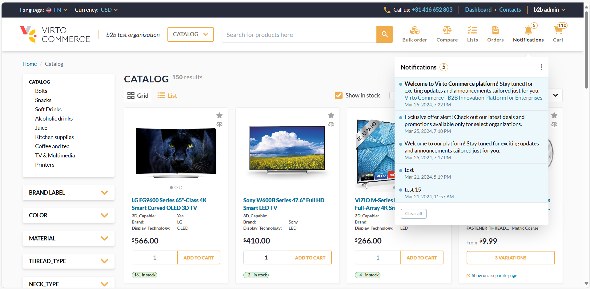
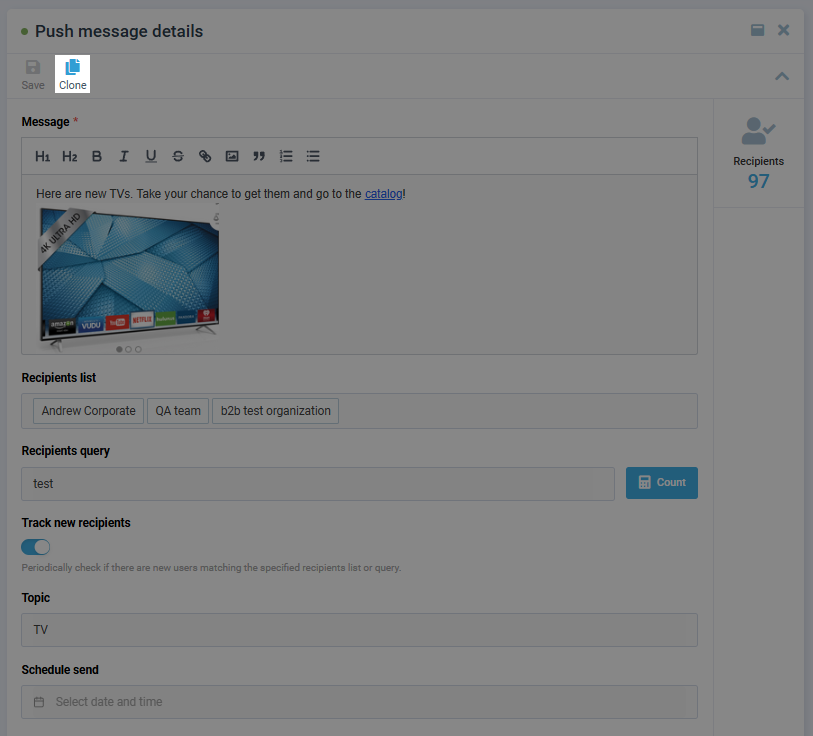
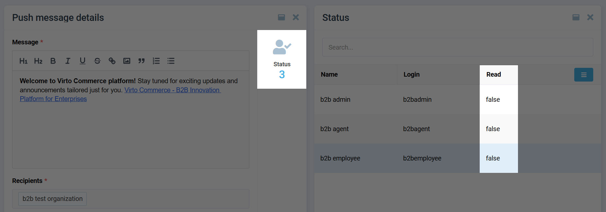

# Manage Push Messages

To manage push messages:

1. Open Platform.
1. Click {: width="25"} in the top left corner.

1. Select **Push Messages** from the list. 

    

1. The following screen opens up:

    {: width="800"}

    Here you can:
    
    * View all the created messages, including:
        * Drafts.
        * Scheduled messages.
        * Messages that are tracking new recipients.
        * Sent messages.
    * [Create new messages](manage-push-messages.md#create-and-schedule-push-message), schedule messages, and track new recipients.
    * [View message status](manage-push-messages.md#view-message-status), the number of recipients, and percent read.

## Create and schedule push message

To create a new push message:

1. Click {: width="20"} in the top toolbar.
1. In the next **New push message** blade:
    * Type the message.
    * Select its recipients from the dropdown list or type their names.
    * Enable the **Track new recipients** switch to periodically check for new users matching the specified recipient list or query. Such messages are stored in the **Track new recipients** item of the left menu.
    * Specify the topic. 
    * If necessary, schedule the date and time to send the message to the recipients. The scheduled messages are stored in the **Scheduled messages** item of the left menu.
1. Click **Save** in the top toolbar to save the message as a draft.
1. Click **Send** to send the messages. The scheduled messages will be sent according to the schedule. 

Your message has been sent to the selected recipients:

## Clone message

To create and send multiple copies of the same message without having to manually recreate the content each time, use the clone message feature:

1. Complete steps 1-4 of the menaging push messages instruction above.
1. In the **Push messages** blade, select the message you want to clone from the messages list. In will open in the next blade.
1. In the **Push message details** blade, click **Clone** in the top toolbar. The cloned message opens in the same blade.

    

1. After all necessary modifications are made, click **Save** in the top toolbar to save the message as a draft, or **Send** to send the messages. The scheduled messages will be sent according to the schedule. 

## View message status

To view the details of the sent push messages:

1. Click on the required message.
1. In the next **Push message details** blade, click **Recipients** in the right sidebar.
1. In the next **Recipients** blade, you can see who of the recipients has read the message.

