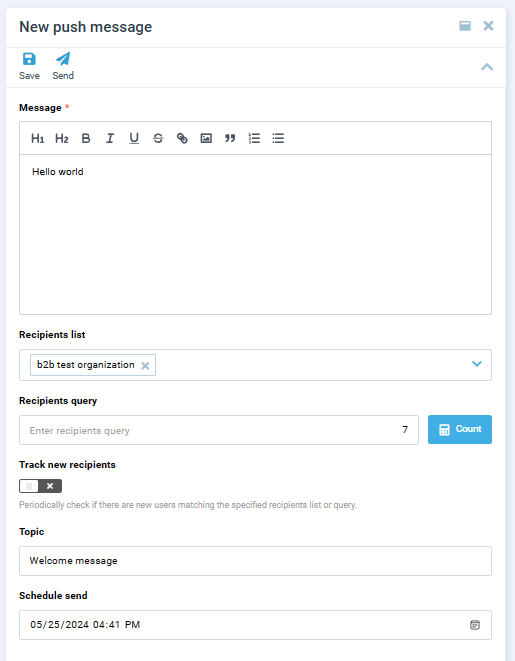
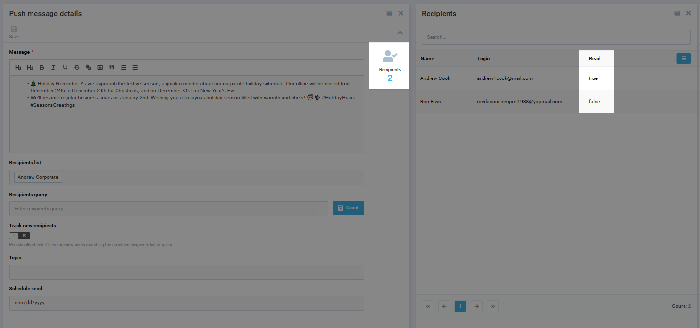

# Manage Push Messages

To manage push messages:

1. Open Platform.
1. Click {: width="25"} in the top left corner.

1. Select **Push Messages** from the list. 

    

1. The list of messages opens up:

    {: width="800"}

    Here you can:
    
    * [Create new messages.](manage-push-messages.md#create-push-message)
    * [View message details.](manage-push-messages.md#view-push-message-details)

## Create Push Message

To create a new push message:

1. Click {: width="20"} in the top toolbar.
1. In the next **Push message details** blade, type the message and select its recipients from the dropdown list. 
1. Click **Save** in the top toolbar to save the changes. 

Your message has been sent to the selected recipients:

## View Push Message Details

To view the details of the sent push messages:

1. Click on the required message.
1. In the next **Push message details** blade, click **Status** in the right sidebar.
1. In the next **Status** blade, you can see who of the recipients has read the message.

