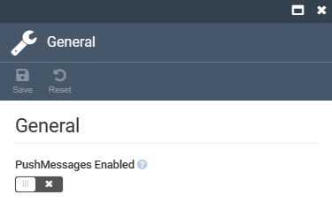
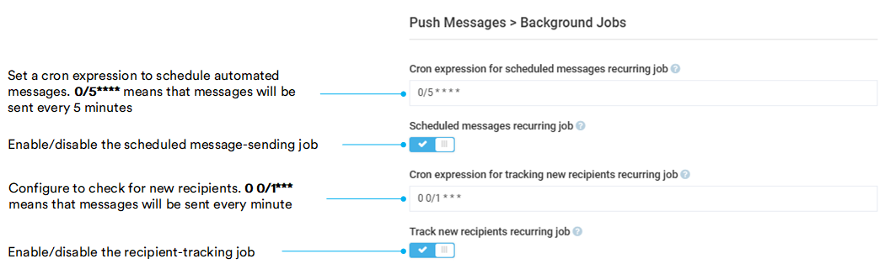
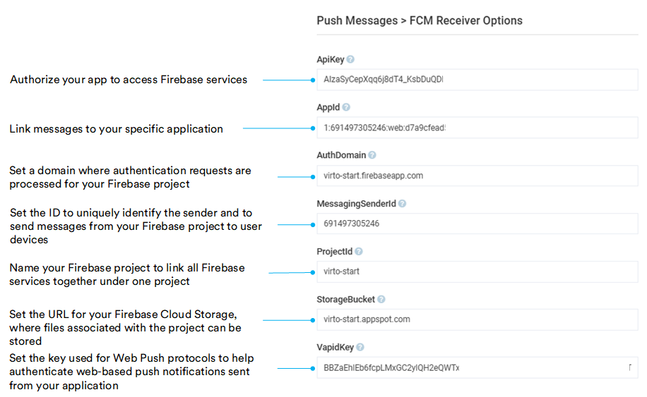

# Settings

To open the settings of the **Push Message** module:

1. Click **Settings** in the main menu.
1. In the search field of the next blade, type **Push message** to find the settings related to the module.
1. Click **General** to configure the following settings:

    

1. Click **Background jobs** to configure the following settings:

    

1. Click **FCM receiver options** to configure the following settings:

    

1. Click **Save** in the top toolbar to save the changes.

The settings have been saved.
