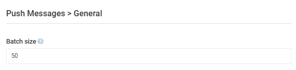
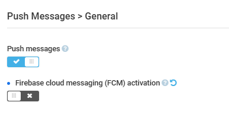
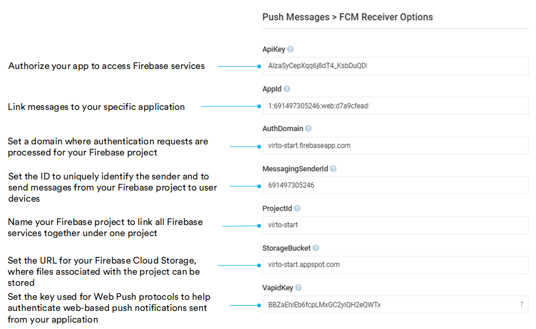
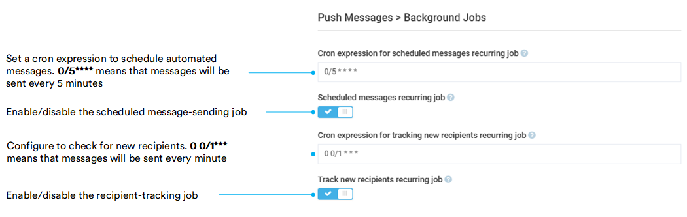

# Settings

Within the **Push Messages** module, you can configure:

* [General settings.](#general-settings)
* [FCM receiver options.](#fcm-receiver-options)
* [Background jobs.](#background-jobs)

## General settings

To configure the module general settings globally:

1. Click **Settings** in the main menu.
1. In the search field of the next blade, type **Push messages** to find the settings related to the module.
1. Click **General**.
1. In the next blade, define the number of messages sent per batch:

    {: style="display: block; margin: 0 auto;" }

1. Click **Save** in the toolbar to save the changes.

Your modifications have been applied.

 
 

To open store-specific module settings:

1. Open **Stores** from the main menu.
1. In the next blade, select  your store.
1. In the next blade, click on the **Settings** widget.
1. Find **Push messages** settings in the left panel and click **General**.
1. In the next blade, configure the following:

    {: style="display: block; margin: 0 auto;" }

1. Click **OK**, then **Save** in the toolbar to save the changes.

Your modifications have been applied.

## FCM receiver options

To configure FCM receiver options:

1. Open **Stores** from the main menu.
1. In the next blade, select  your store.
1. In the next blade, click on the **Settings** widget.
1. Find **Push messages** settings in the left panel and click **FCM Receiver Options**.
1. In the next blade, configure the following:

    {: style="display: block; margin: 0 auto;" }

1. Click **OK**, then **Save** in the toolbar to save the changes.

Your modifications have been applied.

## Background jobs

To configure the background jobs:

1. Click **Settings** in the main menu.
1. In the search field of the next blade, type **Push messages** to find the settings related to the module.
1. Click **Background Jobs**.
1. In the next blade, configure the following settings:

    {: style="display: block; margin: 0 auto;" }

1. Click **Save** in the toolbar to save the changes.

Your modifications have been applied.

 
 
********

    <a href="../firebase-cloud-messaging">← Messaging via Firebase Cloud</a>
    <a href="../../rating-reviews/overview">Rating and Reviews module overview →</a>

