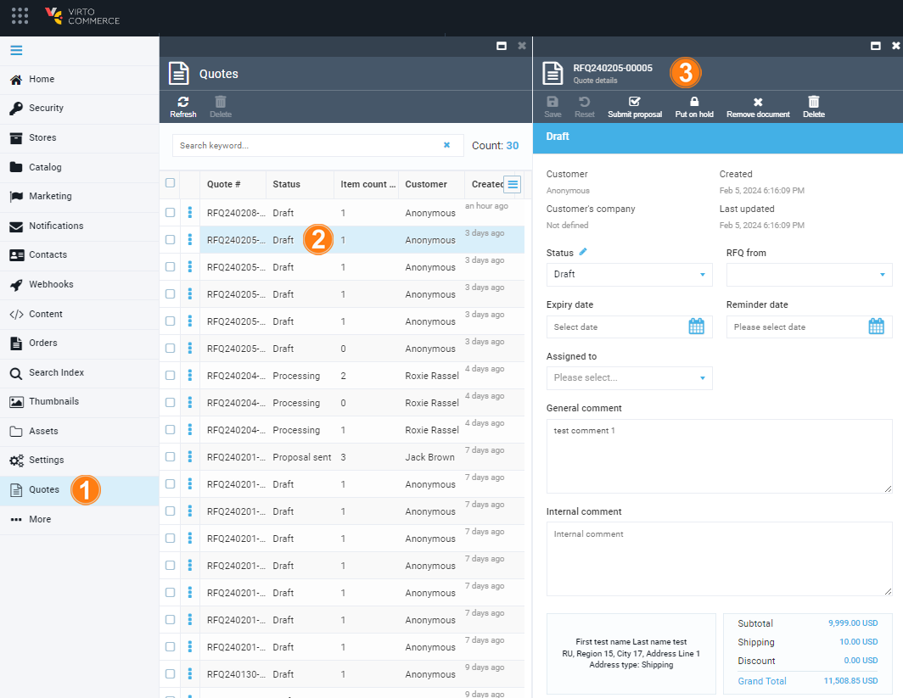
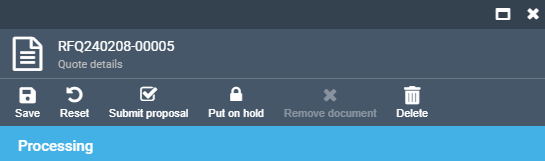
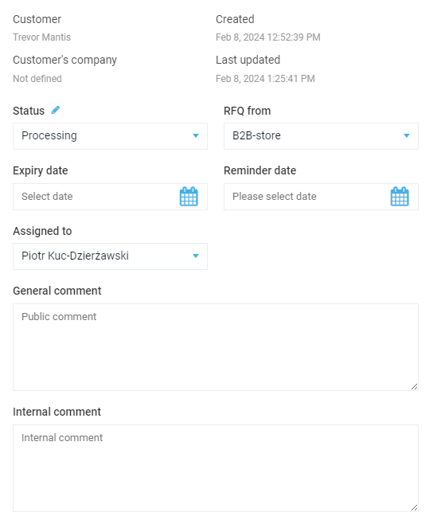
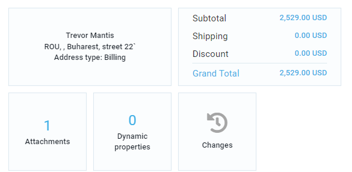
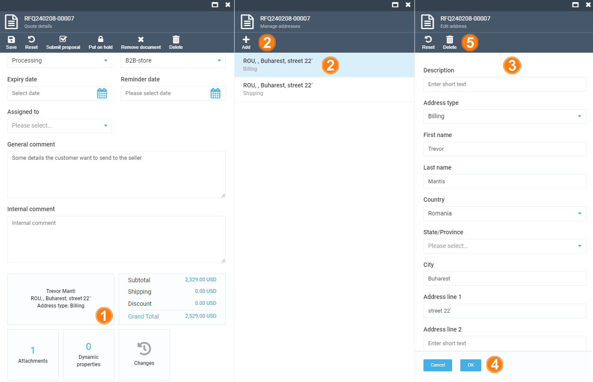
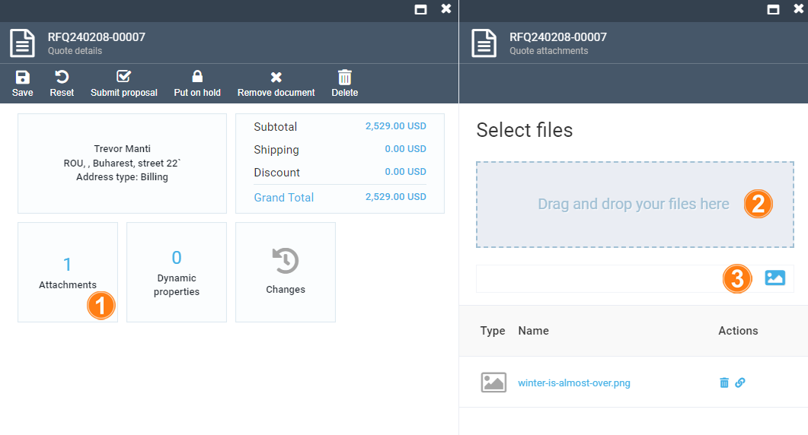
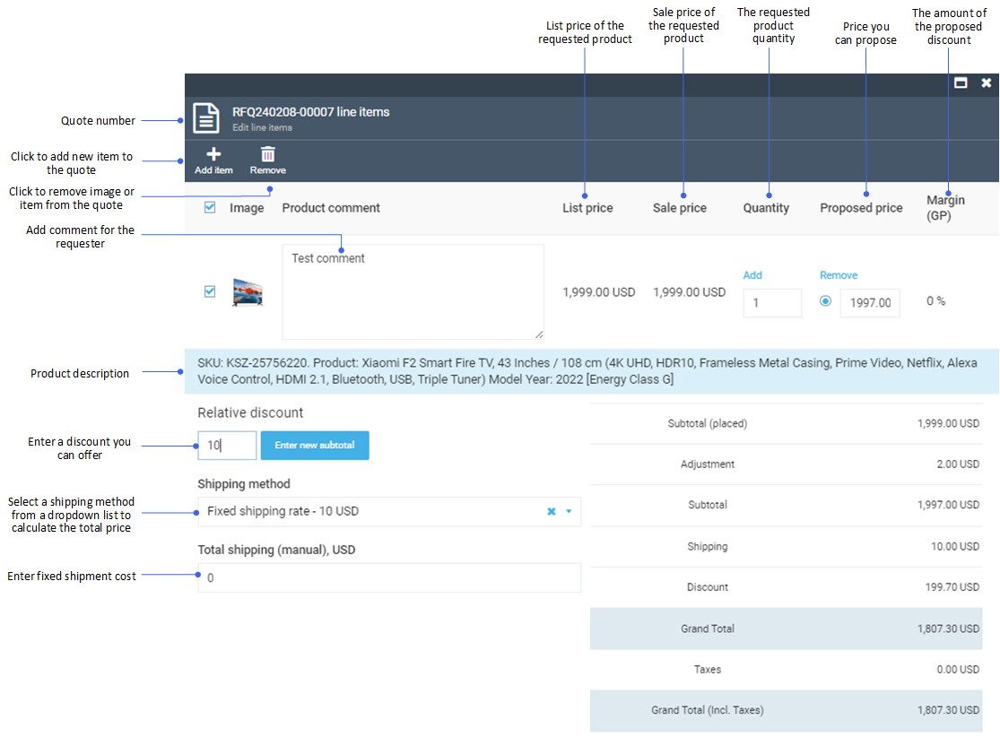
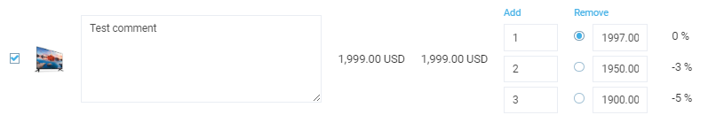

# Manage Quotes

Managing quotes includes:

* [Viewing quotes list and quote details.](manage-quotes.md#view-quotes-list-and-quote-details)
* [Editing quote details.](manage-quotes.md#edit-quote-details)

{: width="25"} [Creating quotes](../../../../storefront/user-guide/shopping/submit-quotes)

## View Quotes List and Quote Details

To view the list of submitted quotes and details of a specific quote:

1. Click **Quotes** in the main menu.

1. In the next **Quotes** blade, select a required quote.

1. Quote details open in the next blade. 

    

You now can view and edit the quote details.

## Edit Quote Details

The quote details blade contains:

* Top menu.
* General information segment.
* Widgets segment.

In the top menu, you can:

* View the current quote status.
* Reset changes in the quote.
* Submit your proposals to potential buyers based on their quote.
* Pause/resume the processing of a quote.
* Cancel a quote with a comment.
* Delete a quote.

    

In the general information section, you can:

* View the quote requester, their company, and the date the quote was created and updated.
* Switch quote status between:

    * Draft.
    * New.
    * Processing.
    * Proposal sent.
    * Ordered.
    * Cancelled.

* View the store from which the RFQ (Request for Quotation) was receved.
* Set the expiry and reminder dates.
* Assign an employee to process the quote from the dropdown list.
* Leave public and internal comments.  

In the widgets section, you can view:

* Shipping and billing addresses of the user who requested the quote.
* Subtotals and totals of the quote.
* Files attached to the quote.
* Quote dynamic properties.
* Quote changes history.

### Edit Shipping/ Billing Addresses

In the widgets section of the **Quote details** blade, you can add or edit shipment/ billing addresses of the quote requester:

1. Click on the address widget.
1. In the next **Manage addresses** blade, select an address to edit from the list or click **Add** in the toolbar to add new address.
1. In the next **Edit address** blade, fill in the required fields.
1. Click **OK** to save the changes, or
1. Click **Delete** in the toolbar to delete the address. 

### Attach Files

Attaching files facilitates the quoting process and ensures that quotes are accurate, relevant, and tailored to the requester's specifications.

To attach files to quotes:

1. Click on the **Attachments** widget.
1. In the next **Quote attachments** blade, drag and drop you files, or
1. Browse your files from your computer.

{: width="800"}

The attached files appear in the list below.

### Manage Quote Totals

To manage quote totals, click on the **Totals** widget. In the next **Edit line items** blade, you can:

* Add or remove items from the quote.
* Propose personalized prices and discounts.
* Calculate grand total based on the shipping rate.

In our example:

* We have proposed a lower price (1997.00 instead of 1999.00). This is the **Adjustment** line in the totals calculation section.

    !!! note
        You can also propose special prices for a specific quantity of products. Click **Add** above the quantity field to specify the quantity and the price.

        

* We have set a relative discount of  10%. This is the **Discount** line in the totals calculation section.
* We have set the shipping rate to 10 USD. This is the **Shipping** line in the calculation section. 

