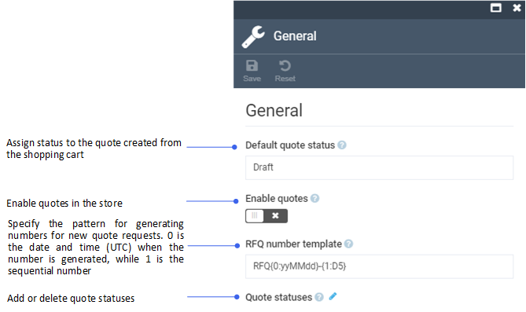

# Settings

To open the Quotes module general settings:

1. Click **Settings** in the main menu.
1. In the search field of the next blade, type **Quotes** to find the settings related to the module.
1. Click **General**.
1. In the next blade, configure the following settings:

    {: style="display: block; margin: 0 auto;" }

1. Click **Save** in the toolbar to save the changes.

The settings have been saved.

 
 
********

    <a href="../manage-quotes">← Managing quotes</a>
    <a href="../../assets/overview">Assets module overview →</a>

