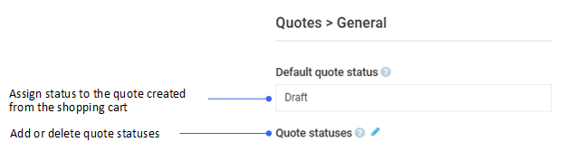
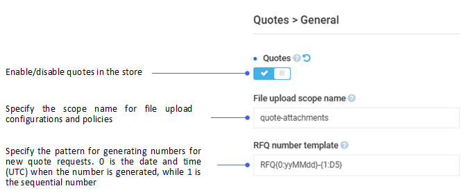

# Settings

To configure the abandoned cart reminder globally:

1. Click **Settings** in the main menu.
1. In the search field of the next blade, type **Quote** to find the settings related to the module.
1. Click **General** to configure the following settings:

    {: style="display: block; margin: 0 auto;" }

1. Click **Save** in the toolbar to save the changes.

The modifications have been applied.

 
 

To configure store-specific reminders:

1. Open **Stores** from the main menu.
1. In the next blade, select  your store.
1. In the next blade, click on the **Settings** widget.
1. Find **Quote** settings in the left panel and configure the following:

    {: style="display: block; margin: 0 auto;" }

1. Click **Save** in the toolbar to save the changes.

The modifications have been applied.

 
 
********

    <a href="../manage-quotes">← Managing quotes</a>
    <a href="../../assets/overview">Assets module overview →</a>

