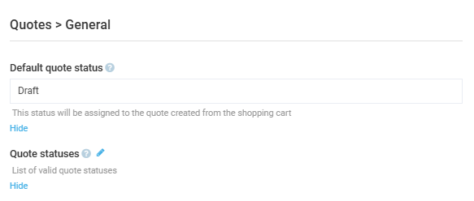
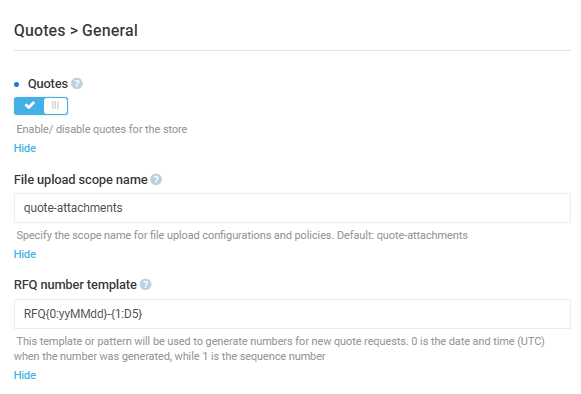

# Settings

Within the **Quotes** module, you can configure:

* [Global settings.](#global-settings)
* [Store-specific settings.](#store-specific-settings)

## Global settings

To configure the module settings globally:

1. Click **Settings** in the main menu.
1. In the search field of the next blade, type **Quotes** to find the settings related to the module.
1. In the next blade, configure the following:

    

1. Click **Save** in the toolbar to save the changes.

Your modifications have been applied.

 
 

## Store-specific settings

To configure the store-specific module settings:

1. Open **Stores** from the main menu.
1. In the next blade, select  your store.
1. In the next blade, click the **Settings** widget.
1. Type **Quotes** in the search bar and select the **General** from the list.
1. In the next blade, configure the following:

    

1. Click **OK**, then **Save** in the toolbar to save the changes.

Your modifications have been applied.

 
 
********

    <a href="../manage-quotes">← Managing quotes</a>
    <a href="../../content/overview">Content module overview →</a>

