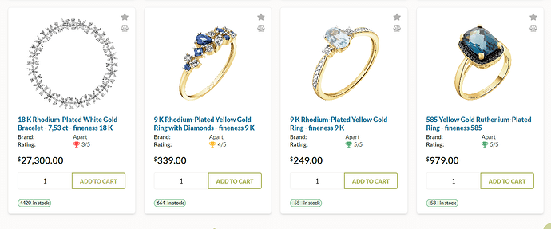

# Manage Reviews

Managing reviews includes:

* [Viewing reviews.](managing-reviews.md#view-reviews)
* [Getting current average rating.](managing-reviews.md#view-average-rating)
* [Moderating reviews.](managing-reviews.md#moderate-reviews)
* [Email review reminders.](managing-reviews.md#email-review-reminders)
* [Enabling/ disabling product reviews.](managing-reviews.md#enable-product-reviews)

## View reviews

To view the list of submitted reviews, click **Rating and Reviews** in the main menu:

## View average rating

To view the products' average rating:

1. Click **Catalog** in the main menu.
1. In the next blade, select the required catalog.
1. In the next blade, select the required item.
1. In the next blade, find the reviews widget.

In our case, the product has received 2 reviews with an average rating of 3.5 out of 5.

## Moderate reviews

Moderating reviews is crucial because it allows you to remove unwanted content and protect your store from spam. To moderate reviews:

1. Click **Rating and Reviews** in the main menu.
1. In the next blade, select the required review.
1. In the next blade, you will see its content and author. In the top toolbar, click:
    * **Approve review** to publish the review and include it in the rating calculation.
    * **Reject Review** to exclude it from the rating calculation. The review will remain in the list with the status **Rejected**.
    * **Reset Review Status** to change your previous decision to approve or reject the review.
    * **Delete** to delete the review without the option to restore it. 

## Email review reminders

To remind a customer to leave a feedback about the purchased order:

1. [Configure Order request review notification.](managing-reviews.md#configure-order-request-review-notifications)
1. [Enable Email Review Reminder option.](managing-reviews.md#email-review-reminders)

### Configure order request review notifications

To configure order request review notifications:

1. In the main menu, click **Notifications**.
1. In the next blade, click **Notification list**.
1. In the next blade, click **Order request review notification**.
1. Fill in the fields as described [here](../notifications/notification-list.md#email-notifications) or use the [Notification Templates](../notifications/notification-templates.md).

!!! note
    You can [customize your notifications for a specific store](../store/settings.md).

### Enable email review reminder

To enable email review reminder:

1. In the main menu, click **Settings**.
1. In the next blade, select **Product Reviews**.
1. Click **Email Review Reminder**.
1. In the next blade, enable the reminder in fill in the fields.

    

1. Click **Save** in the toolbar to save the changes.

The customer will be reminded to review the product they bought.

## Enable product reviews

The implementation partners can now control the visibility of the reviews functionality in a theme based on the installation of the Quote module. When the Quote module is installed, the reviews feature in the theme is automatically activated. By uninstalling or removing the module, the reviews are deactivated:

