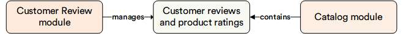

# Overview [In Progress]

The **Ratings and Reviews** module empowers users to contribute reviews and ratings for entities within the system.

You can use rating information for sorting and filtering review objects. Ratings and reviews can be displayed for users upon request.

## Key Features

The Ratings and Reviews module facilitates:

* Moderation and validation of reviews.
* Approval or rejection of reviews.
* Updating existing reviews.
* Retrieving ratings.
* Multi-store and single-store capability, with each store having its own reviews.
* Configurable rating calculator, including both average and [Wilson](https://www.evanmiller.org/how-not-to-sort-by-average-rating.html).
* Email review reminders for customers who have purchased products, encouraging them to return and leave a review.

The diagram below illustrates the interconnections among various key entities within the Rating and Reviews module:

