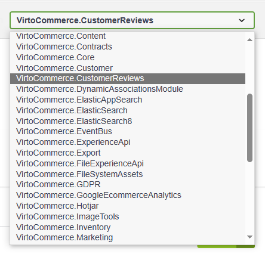
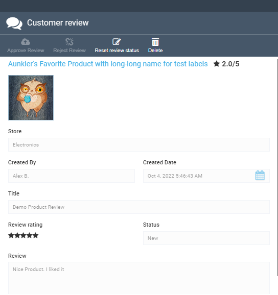

# REST API

Access the [REST API endpoint](https://virtostart-demo-admin.govirto.com/docs/index.html) and select **VirtoCommerce.CustomerReviews** from the dropdown list.



Below are some examples of using REST API functionality to:

* [Submit reviews](rest-api.md#submit-reviews)
* [View reviews](rest-api.md#view-reviews)
* [Request ratings](rest-api.md#request-rating)
* [Moderate reviews](rest-api.md#moderate-reviews)

## Submit Reviews

1. Select **POST /api/customer reviews** from the menu.
1. Fill in the request body as follows: 

    ```json
    [
      {
        "storeId": "Electronics",
        "userId": "test_user_id",
        "userName": "Alex B.",
        "EntityId": "baa4931161214690ad51c50787b1ed94",
        "EntityType": "Product",
        "EntityName": "Aunkler's Favorite Product",
        "title": "Demo Product Review",
        "review": "Nice Product. I liked it",
        "rating": 5
      }
    ]
    ```
1. Click **Execute**.
1. In the platform, select **Rating and Reviews** from the main menu.
1. In the next blade, click on the newly created review: 

    


## View Reviews

1. Select **POST /api/customer reviews/reviewList** from the menu.
1. Fill in the request body as follows: 

    ```json
    {
        "reviewStatus":null,
        "sort":"",
        "take":20,
        "skip":0
    }
    ```

1. Click **Execute** to receive the following response:
    
    ```json
    {
        "totalCount":7,
        "results":[
            {
                "id":"fc9a07db-f09f-4a85-bafc-f5e9299d3301",
                "entityId":"8c01bcf0-4bab-4675-97b9-ea6cc41912e5",
                "entityName":"Aunkler's Favorite Product",
                "entityType":"Product",
                "reviewStatus":"Approved",
                "reviewStatusId":1,
                "title": "Demo Product Review",
                "review": "Nice Product. I liked it",
                "rating":5,
                "userName":"Alex B.",
                "storeName":"Electronics",
                "createdDate":"2022-10-04T03:46:43.433Z"
            },
            {...}
        ]
    }
    ```

## Request Rating

1. Select **POST /api/rating/entityRating** from the menu.
1. Fill in the request body as follows: 

    ```json
    {
        "entityIds": [
            "8c01bcf0-4bab-4675-97b9-ea6cc41912e5"
        ],
        "entityType":"Product"
    }
    ```

1. Click **Execute** to receive the following response:
    
    ```json
    [
        {
            "storeName":"Electronics",
            "storeId":"Electronics",
            "entityId":"8c01bcf0-4bab-4675-97b9-ea6cc41912e5",
            "entityType":"Product",
            "value":3.50,
            "reviewCount":2
        }
    ]
    ```

## Moderate Reviews

=== "Approve"

    1. Select **POST /api/customerReviews/approve** from the menu.
    1. Fill in the request body as follows: 

        ```json
        [
            "fc9a07db-f09f-4a85-bafc-f5e9299d3301"
        ]
        ```

    1. Click **Execute**.

=== "Reject"

    1. Select **POST /api/customerReviews/reject** from the menu.
    1. Fill in the request body as follows: 

        ```json
        [
            "fc9a07db-f09f-4a85-bafc-f5e9299d3301"
        ]
        ```

    1. Click **Execute**.


=== "Reset"

    1. Select **POST /api/customerReviews/reset** from the menu.
    1. Fill in the request body as follows: 

        ```json
        [
            "fc9a07db-f09f-4a85-bafc-f5e9299d3301"
        ]
        ```

    1. Click **Execute**.

=== "Delete"

    1. Select **DELETE /api/customerReviews** from the menu.
    1. Fill in the request body as follows: 

        ```json
        {
            "ids":
            [
                "fc9a07db-f09f-4a85-bafc-f5e9299d3301"
            ]
        }
        ```

    1. Click **Execute**.
